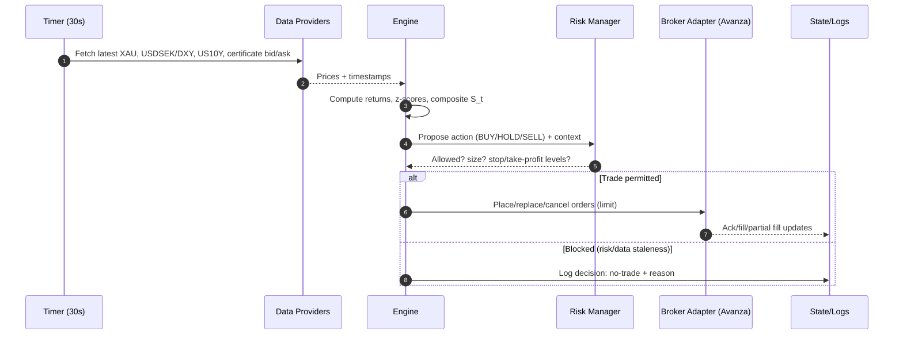

# Automated Intraday Trading Bot for Avanza “BULL GULD X20 AVA” Certificates

## Executive summary

This report designs an automated intraday trading system that monitors gold (XAUUSD or a close proxy), USD/SEK (or DXY), and US 10‑year yields (US10Y), then trades an Avanza-listed **daily-leveraged 20× Bull & Bear certificate** similar in structure to *BULL GULD X20 AVA* products issued by **Morgan Stanley & Co. International plc**. Morgan Stanley’s product details for *BULL GULD X20 AVA 4* show the key mechanics you must engineer around: **daily leverage = 20**, **Reset Level** and **Financing Level** (daily rebalanced), **product currency SEK** while **underlying currency USD**, and **financing spread p.a. 3%**.

The core constraints are not “alpha math” but **data rights + execution access + intraday risk**. Official/public sources (Riksbank, ECB, US Treasury, FRED, LBMA benchmarks) are trustworthy but mostly **daily / benchmark** and therefore inadequate for a 30‑second intraday bot without a commercial intraday feed. The design therefore uses a **two-tier data strategy**: (a) paid/real-time intraday market data for signal generation; (b) official sources as validation/fallback. Riksbank itself states its exchange rates are *indicative only* and published at specific daily times (exchange rates at **16:15** Swedish banking days), and explicitly disclaims transactional use. US Treasury “Daily Treasury Yield Curve Rates” are also based on **closing** bid-side quotations collected around 3:30 p.m. (not intraday).

On execution, Avanza provides stop-loss order functionality in its platform, but **Avanza does not publish a universally available official trading API**. Unofficial wrappers exist, but they are explicitly described by their authors as “proof of concept” and subject to removal or breaking changes, and Avanza’s own site terms (at least on Avanza’s corporate web) prohibit bots/scraping without written permission. Practically, a safe path is to obtain **written permission / partner access** from Avanza, or use a broker with an official trading API for the *same economic exposure* (gold futures/ETPs) and treat Avanza execution as optional.

A rigorous composite signal is specified below, combining 30‑second standardised moves in XAU/USD (or proxy), USD/SEK (or DXY), and US10Y yield changes, then mapping that to buy/exit thresholds, position sizing, and daily close-out before the Nasdaq Nordic pre-close/closing auction windows (continuous trading ends **17:25**, then auction processes run to ~**17:30** with randomised uncross).

## Instrument and market microstructure constraints

### What the certificate is and why it behaves differently than spot gold

Morgan Stanley’s *BULL GULD X20 AVA* product type is **“Bull & Bear”** with **daily leverage** and daily “Reset Level” / “Financing Level” parameters. For the comparable instrument page, Morgan Stanley publishes: **Daily Leverage 20**, **Reset Level**, **Financing Level**, **Underlying: Gold GSCI®**, **Underlying currency USD**, **Currency SEK**, and **Financing Spread p.a. 3%**.

The “Gold GSCI®” underlying itself is referenced as **S&P GSCI® Gold Index** with **Bloomberg code SPGSGCP Index** and currency USD (per Morgan Stanley’s underlying details page). A closely-related S&P DJI description notes that an S&P GSCI Gold variant tracks the **COMEX gold future** and can incorporate an interest-rate component in total return calculations.  
Implication: your bot is *not* trading “spot gold”; it is trading a **daily rebalanced leveraged index exposure** whose SEK price is sensitive to **gold futures + USD/SEK FX** (unless explicitly hedged, which is not indicated on the Morgan Stanley page).

### Daily reset and path-dependence

Daily-leverage products reset exposure each trading day; their multi-day performance is **not** simply “20× the multi-day underlying return” because compounding makes the result path-dependent. This is a standard property of daily reset leveraged ETPs.  
Operational consequence: the bot should treat the certificate as an **intraday vehicle** and implement a hard “flatten” rule before market close, plus strict gap-risk avoidance.

### Market maker and liquidity risk

Morgan Stanley states that a market maker provides bid/ask prices “under normal market conditions” but reserves the right to suspend quoting and is not obligated to provide continuous quotes.  
Combined with your screenshot’s spread readout (e.g., ~0.42% at that moment), the correct assumption is **liquidity is conditional**: spreads can widen sharply, prices can gap, and you may not be able to exit at a desired time.

### Trading hours and auction windows in Sweden

For Swedish equities-style venues, trading is commonly referenced as 09:00–17:30 Swedish time. Nordea lists Stockholmsbörsen opening hours as **09:00–17:30**.  
More importantly for a bot, Nasdaq’s Nordic market model specifies **continuous trading ends at 17:25**, then a pre-close period with no auto matching occurs, and the closing call uncross is randomised between **17:29:30 and 17:30:00**.  
Bot consequence: schedule forced exits **before 17:25** (practically 17:20) to avoid auction uncertainty and late-day liquidity deterioration.

## Data sources and API integration strategy

### Reality check on “official” vs “tradable intraday” data

You requested a 30‑second polling cadence. Official/primary sources are best for *validity* but often unsuitable for *intraday latency*:

- **US10Y (official):** US Treasury’s daily yield curve is derived from **closing** market bid quotations (FRBNY ~3:30pm), not real-time.  
- **USD/SEK (official SEK reference):** Riksbank publishes exchange rates daily at **16:15**, intended as indicative information and “not for transactional purposes.”  
- **Gold benchmark (official):** LBMA benchmark data requires a licence for real-time or historical use; it is a benchmark, not a tick-by-tick trade feed.  

Therefore, for a 30‑second intraday bot you will almost certainly need **licensed real-time market data** from a broker/data vendor, plus the official sources as fallback and reconciliation.

### Recommended data architecture: primary + fallback layers

Primary (intraday, tradable-quality) suggestions:

- **FX + gold spot proxy:** OANDA v20 can stream pricing and provides instrument candles; it is designed for live pricing and trading.  
- **Gold futures & DXY:** the primary venues are CME (gold futures) and ICE (DXY futures). ICE states USDX futures trade ~21 hours/day.  
- **US10Y intraday:** if you cannot obtain an actual yield feed, use a **proxy** that is liquid and intraday (e.g., 10‑year Treasury note futures price or a broker-provided yield index). (This is an engineering compromise; the official yield series are not intraday.)  

Fallback (official validation / “sanity check”):

- **Riksbank REST API:** official SEK rates/series, API is free with IP-based limits unless registered; rates are indicative.  
- **ECB SDMX API:** official SDMX REST access to ECB statistics.  
- **US Treasury XML feed:** machine-readable daily yield curve access.  
- **FRED API:** easy access to series observations (e.g., DGS10), subject to terms of use.  

### Candidate APIs and characteristics table

| Provider | What it covers for this bot | Auth | Rate limits (documented) | Why you’d use it |
|---|---|---|---|---|
| OANDA v20 | USD/SEK pricing & candles; XAU/USD (if enabled on your account) via pricing stream | Bearer token | REST API limit **120 requests/sec**; pricing served via streaming URLs; pricing windows not perfectly aligned across subscribers | Strong fit for 30s cadence; streaming reduces polling drift |
| Twelve Data | Multi-asset market data by credits; supports WebSocket streaming; API & WebSocket credits tracked separately | API key | Credits/min reset each minute; example **Pro 610 = 610 credits/min**, Basic has daily cap; WebSocket tick latency up to ~170ms | Convenient single vendor; use WebSocket for intraday latency |
| Saxo OpenAPI | Trading + market data across asset classes | OAuth 2.0 access token | Default: **120 requests/min per session**; **max orders 1/sec**; plus large daily app limits | If you decide to execute outside Avanza using an official brokerage API |
| IBKR Web / Client Portal API | Trading + market data; REST + websocket; OAuth available | OAuth (various) | Global request rate limit guidance (e.g., 10 req/sec/session in IBKR docs) | Professional-grade; if you shift execution to IBKR |
| Riksbank REST API (fallback) | SEK exchange rates & interest-rate series (official) | API key (higher limits), some endpoints public | IP-based call limits unless registered; rates indicative, not transactional | Official fallback/validation for SEK levels |
| US Treasury (fallback) | Daily Treasury yields (closing) | none | XML feed parameters + pagination | Official reference for yield levels; not intraday |
| FRED (fallback) | DGS10 etc series observations | API key | Terms prohibit unreasonable bandwidth; standard API usage expectations | Simple historical downloads and daily references |
| ICE (primary venue) | DXY futures | licence/vendor | Market data is licensed; DXY is ICE product; futures trade ~21 hours/day | The primary DXY market if you truly need DXY |

### Sample endpoints and authentication patterns

All URLs are shown in code blocks (per your preference for implementation-ready snippets).

```text
# OANDA v20 pricing (stream-capable endpoint)
GET https://api-fxtrade.oanda.com/v3/accounts/{ACCOUNT_ID}/pricing?instruments=USD_SEK,XAU_USD
Authorization: Bearer ${OANDA_ACCESS_TOKEN}

# OANDA v20 candles
GET https://api-fxtrade.oanda.com/v3/instruments/USD_SEK/candles?granularity=S5&count=500
Authorization: Bearer ${OANDA_ACCESS_TOKEN}
```
OANDA pricing endpoint behaviour and rate limiting are documented in their official materials.

```text
# Riksbank SWEA latest observations (example endpoint; group 130 commonly used for FX)
GET https://api.riksbank.se/swea/v1/Observations/Latest/ByGroup/130
# (For higher limits / full access, register and use an API key via the API portal.)
```
Riksbank’s API is official, but values are indicative and not transactional.

```text
# US Treasury daily yield curve XML feed
GET https://home.treasury.gov/resource-center/data-chart-center/interest-rates/pages/xml?data=daily_treasury_yield_curve&field_tdr_date_value=2025
```
Treasury publishes XML feed parameters and examples; yields are a closing-derived curve.

```text
# FRED series observations (e.g., daily 10Y Treasury yield DGS10)
GET https://api.stlouisfed.org/fred/series/observations?series_id=DGS10&api_key=${FRED_API_KEY}&file_type=json
```
FRED documents endpoint parameters and terms of use.

### Data mapping and alignment

You need a strict mapping layer so decisions are deterministic.

- **Time basis:** store everything in **UTC** internally; convert to `Europe/Stockholm` only for session scheduling and logs. (Nasdaq Nordic phases are specified in CET in the Nasdaq model, and Sweden switches CET/CEST, so using UTC internally avoids DST bugs.)  
- **Bars:** with 30‑second polling, you can compute 30‑second “pseudo-bars” from last prices; if you can subscribe to ticks, aggregate to 30‑second bars yourself (recommended). Twelve Data notes that completed 1‑minute candles can appear later than the close time (example availability 10:01:18–10:03:00), which is a warning against relying on vendor-built 1‑minute candles for fast strategies.  
- **Symbol mapping:**  
  - Gold: prefer a tradable proxy (COMEX gold futures via a broker feed) or spot XAU/USD from a reputable FX/metals feed.  
  - USD/SEK: direct `USDSEK` or OANDA `USD_SEK`.  
  - DXY: ICE USDX futures (primary) or vendor index feed.  
  - Certificate: Avanza/Nasdaq order book ID + ISIN (Avanza UI shows these; Morgan Stanley provides ISINs for each series).  

### Latency and polling cadence design

A 30‑second loop is amenable to “near-real-time” but still susceptible to stale or misaligned updates:

- OANDA warns pricing windows across subscribers aren’t always aligned to the top of the second; in fast markets you can observe different prices depending on alignment.  
- For lowest delay, use streaming where possible; Twelve Data states WebSocket tick latency can be ~170ms and distinguishes long-polling vs server push.  

Recommended cadence pattern: trigger every 30s, but **collect ticks continuously** (WebSocket) and compute the 30s return at the boundary. If you must poll, stagger requests within each 30s window (e.g., fetch FX at t+0.0s, gold at t+0.5s, yield proxy at t+1.0s, certificate quotes at t+1.5s) and record timestamps to compute staleness.

## Signal definition and risk management

### Why these drivers are sensible

Gold is widely modelled as inversely related to (expected) real rates and often negatively related to USD strength. The Federal Reserve Bank of Chicago notes that higher expected real rates “should drive down” gold prices and that gold is expected to have a strong inverse relationship with long-term real rates. The World Gold Council also references “weaker US dollar and real rate trajectories” as key fundamentals in commentary.  
These sources justify using USD strength and yields as conditioning variables for intraday gold trades (while recognising relationships vary over time).

### Exact composite signal formulas

Let the bot sample all three signals every Δt = 30s.

Inputs (at time t):

- Gold price \(G_t\) (XAUUSD or proxy)  
- FX rate \(F_t\) = USDSEK (SEK per USD), or else DXY \(D_t\) (dimensionless index)  
- US10Y yield \(Y_t\) in **decimal** (e.g., 0.0425 = 4.25%)

Compute 30s log-returns for price series and bps change for yield:

\[
r^G_t = \ln\left(\frac{G_t}{G_{t-\Delta t}}\right),\quad
r^F_t = \ln\left(\frac{F_t}{F_{t-\Delta t}}\right)
\]
\[
\Delta y^{bps}_t = 10000 \cdot (Y_t - Y_{t-\Delta t})
\]

Standardise to comparable units with a rolling window of N samples (e.g., N=120 = 60 minutes):

\[
z^G_t = \frac{r^G_t - \mu(r^G_{t-N:t-1})}{\sigma(r^G_{t-N:t-1})+\epsilon}
\]
\[
z^F_t = \frac{r^F_t - \mu(r^F_{t-N:t-1})}{\sigma(r^F_{t-N:t-1})+\epsilon}
\]
\[
z^Y_t = \frac{\Delta y^{bps}_t - \mu(\Delta y^{bps}_{t-N:t-1})}{\sigma(\Delta y^{bps}_{t-N:t-1})+\epsilon}
\]

Composite score (long-bull-gold certificate prefers gold up, USD weaker, yields down):

\[
S_t = w_G z^G_t - w_F z^F_t - w_Y z^Y_t
\]
with recommended starting weights \(w_G=0.50,\; w_F=0.30,\; w_Y=0.20\) and \(\;w_G+w_F+w_Y=1\).

If you use DXY instead of USDSEK (choose one to avoid redundancy), replace \(z^F_t\) with \(z^D_t\).

### Entry/exit thresholds and confirmation

Use a two-threshold regime to reduce churn:

- **Enter long** (buy certificate) if:
  - \(S_t \ge \theta_{in}\) for **K consecutive polls** (K=2 is a good start), and
  - \(z^G_t > 0\) (gold momentum confirmation), and
  - certificate market quality checks pass (spread ≤ max, quotes present).
- **Exit** (sell certificate) if:
  - \(S_t \le \theta_{out}\) (typically \(\theta_{out}=0.2\)), or
  - stop-loss / take-profit hit, or
  - time-based exit approaching close.

Initial thresholds (tune via walk-forward backtest):
- \(\theta_{in} = 1.0\) (one standard deviation composite move)
- \(\theta_{out} = 0.2\)

### Position sizing in SEK (certificate quantity)

Let:
- Equity \(E\) (SEK)
- Risk budget per trade \(R = \rho \cdot E\), with \(\rho = 0.3\%\) to 1.0% depending on risk tolerance
- Entry ask price \(P_{ask}\) (SEK per certificate)
- Stop price \(P_{stop}\) (SEK per certificate)

Per-unit risk: \(u = P_{ask} - P_{stop}\).  
Quantity:
\[
q = \left\lfloor \frac{R}{u} \right\rfloor
\]

Also apply a **max notional constraint** (because 20× instruments can blow up quickly):

\[
q \le \left\lfloor \frac{\eta \cdot E}{P_{ask}} \right\rfloor
\]
where \(\eta\) might be 5%–15% of equity for this product class.

### Stop-loss, take-profit, and daily reset handling

Because the product resets daily and is 20×, use stops in **underlying space** and translate approximately to certificate space.

Approximate intraday linearity (small moves):
- If certificate is a daily 20× product, a small underlying move \( \delta \) can translate to about \(20\delta\) in the certificate (ignoring fees/FX quirks). This is a modelling approximation; the product is daily rebalanced and path dependent.

Practical rule set (starter):
- **Stop-loss:** underlying adverse move of 0.25% from entry (≈5% certificate move) OR composite flips hard (\(S_t < 0\)).  
- **Take-profit:** underlying favourable move of 0.35%–0.50% (≈7%–10% certificate).  
- **Time stop:** if trade doesn’t reach TP within X minutes (e.g., 60–120), exit when \(S_t\) decays below \(\theta_{out}\).  
- **Daily flatten:** exit all positions at ~17:20 Stockholm time to avoid pre-close microstructure and overnight path risk. Continuous trading ends at 17:25 and closing uncross is randomised before 17:30.

## Execution flow on Avanza and operational risk controls

### Avanza execution assumptions and constraints

Assumptions (because Avanza’s exact API access level is not specified):
- You have a normal Avanza account with permission to trade this certificate.
- Automated order placement is only possible if:  
  - Avanza provides you explicit partner/API access, **or**  
  - you use an **unofficial** interface (higher operational and contractual risk), **or**  
  - you operate semi-automatically (bot generates orders; human approves).

Caution: Avanza states (at least on one of its web properties) that it is **not allowed to use robots/scrapers/automated tools without written permission**, and the unofficial API ecosystem is explicitly “proof of concept” and breakable.

### Order types, spreads, slippage, partial fills

For thin/market-maker products:
- Prefer **limit orders** at (or slightly through) the current ask when buying, and at (or slightly through) the bid when selling.
- Avoid market orders during widened spread periods; the issuer market maker may suspend quotes during extraordinary markets.  
- Expect **partial fills** if order book depth is limited; implement a “fill-or-kill after T seconds” loop: place limit → wait short → revise/cancel/replace at updated price.

Avanza Stop Loss function notes:
- Stop-loss orders are transmitted to the exchange **only when trigger conditions are met**, and then join the time-priority queue; triggers may compare against last trade or liquidity provider quotes.  
This is useful as a safety layer but not a substitute for bot-side risk management.

### Core risk controls and kill-switch design

Implement controls at three layers:

Strategy layer:
- Max trades/day
- No trade when data stale (e.g., any source timestamp older than 2×poll interval)
- No trade if certificate spread > spread_max (e.g., >1.0%)

Portfolio layer:
- Max notional exposure (e.g., 10% of equity)
- Max open positions = 1 (simplifies daily leveraged product risk)
- Daily loss limit (e.g., -1.5% equity triggers trading halt)

System layer:
- Circuit breaker on repeated API errors (e.g., 5 consecutive failures)
- Circuit breaker on extreme volatility (e.g., 30s gold return beyond X sigma)
- Manual kill-switch env var (`KILL_SWITCH=1`) or remote control (e.g., signed command)

### Intraday event timing considerations

US events often drive gold, USD, and yields:
- BLS Employment Situation releases are scheduled at **08:30 Eastern Time**.  
- FOMC statements are typically released at **2:00 p.m. ET** (as shown on Federal Reserve statements).  
Stockholm-time mapping varies with US/EU daylight saving changes; your bot should use an economic calendar feed (or pre-loaded release calendar) rather than hardcoded CET times.

## Architecture, code design, diagrams, and a runnable prototype

### High-level architecture

```mermaid
flowchart TB
  subgraph DataLayer[Data Layer]
    FX[FX feed: USD/SEK or DXY]
    YLD[Yield feed: US10Y or proxy]
    XAU[Gold feed: XAUUSD/Gold futures proxy]
    CERT[Certificate quotes: bid/ask/last]
    FALLBACK[Fallback: Riksbank/ECB + Treasury/FRED]
  end

  subgraph Core[Core Trading Engine]
    NORM[Normalise & align timestamps (UTC)]
    FEAT[Feature calc: returns, bps, z-scores]
    SIG[Composite signal S_t]
    RISK[Risk manager: sizing, stops, limits]
    OMS[Order manager: place/replace/cancel]
    STATE[State store: positions, orders, session]
  end

  subgraph Exec[Execution]
    AVZ[Avanza adapter (official if available; else mock/manual)]
    MKT[Nasdaq Nordic venue / market maker]
  end

  subgraph Ops[Operations]
    LOG[Structured logs]
    METR[Metrics/alerts]
    BT[Backtester / walk-forward]
  end

  FX --> NORM
  YLD --> NORM
  XAU --> NORM
  CERT --> NORM
  FALLBACK --> NORM

  NORM --> FEAT --> SIG --> RISK --> OMS --> AVZ --> MKT
  OMS --> STATE
  RISK --> STATE

  Core --> LOG
  Core --> METR
  BT --> Core
```

### Execution sequence per 30-second cycle



### Intraday timeline chart (Stockholm time)

```mermaid
gantt
  title Intraday Bot Timeline (Europe/Stockholm)
  dateFormat  HH:mm
  axisFormat  %H:%M

  section Nasdaq Nordic session
  Pre-open / opening auction (exchange-specific)  :a1, 08:55, 00:05
  Continuous trading                              :a2, 09:00, 08:25
  Pre-close (no auto matching)                    :a3, 17:25, 00:05
  Closing uncross window (randomised)             :a4, 17:29, 00:01

  section Bot controls
  Start trading window (avoid open noise)         :b1, 09:02, 08:18
  Force flatten (avoid pre-close/auction)         :b2, 17:20, 00:01
```



Continuous trading end and closing randomisation come from Nasdaq’s Nordic market model.

### Code design (modules)

A minimal but production-oriented Python layout:

- `config.py` – env var parsing, risk params, instrument IDs  
- `data/`  
  - `providers.py` – interfaces + concrete providers (OANDA, TwelveData, FRED/Treasury fallback)  
  - `cache.py` – last values, staleness tracking  
- `signals.py` – returns, rolling stats, composite \(S_t\)  
- `risk.py` – sizing, stops, daily limits, circuit breakers  
- `broker/`  
  - `avanza_adapter.py` – **mock mode by default**, optional real adapter  
  - `models.py` – order/position objects  
- `runner.py` – 30s loop, orchestration  
- `tests/` – unit + integration tests (mock providers)

### Pseudocode for decision logic

```text
every 30 seconds:
  data = fetch(XAU, FX, US10Y, cert_bid_ask)

  if any data stale or missing:
    if position open: consider safe exit using conservative limit
    continue

  compute rGold, rFX, dYbps
  compute z-scores over rolling window
  S = wG*zGold - wFX*zFX - wY*zY

  if time >= flatten_time:
    if position open: place exit order; disable new entries
    continue

  if no position:
    if S >= theta_in for 2 polls and spreads ok:
      qty = size_from_risk(entry_ask, stop_level)
      place buy limit
  else:
    if stop or take-profit reached OR S <= theta_out:
      place sell limit (or stop logic)
```

### Runnable Python prototype snippet (mock-mode order preparation)

This runs without broker credentials. If you add real data adapters, it will poll every 30s and compute signals; orders are printed as “prepared”.

```python
#!/usr/bin/env python3
"""
Intraday composite-signal bot (30s cadence) for a daily-leveraged Bull Gold certificate.
- Default: MOCK data + MOCK Avanza broker adapter (no live trading).
- Replace TODO sections with real providers and Avanza execution (only with permission).
"""

from __future__ import annotations

import os
import time
import math
import json
import random
import logging
from dataclasses import dataclass, asdict
from datetime import datetime, timezone
from typing import Deque, Optional, Dict, Tuple
from collections import deque

import numpy as np

# ---------- Configuration ----------

@dataclass(frozen=True)
class BotConfig:
    poll_seconds: int = 30
    window_n: int = 120  # 120 * 30s = 60 minutes
    eps: float = 1e-9

    w_gold: float = 0.50
    w_fx: float = 0.30
    w_yield: float = 0.20

    theta_in: float = 1.0
    theta_out: float = 0.2
    confirm_polls: int = 2

    # Risk params
    risk_fraction: float = 0.005   # 0.5% of equity per trade
    max_notional_fraction: float = 0.10  # 10% of equity
    daily_loss_limit_fraction: float = 0.015  # 1.5% of equity

    # Trading hours (Stockholm time) — keep simple in prototype
    flatten_hour: int = 17
    flatten_minute: int = 20

    # Certificate identifiers (placeholders)
    cert_orderbook_id: str = os.getenv("AVANZA_ORDERBOOK_ID", "REPLACE_ME")
    cert_symbol: str = os.getenv("CERT_SYMBOL", "BULL GULD X20 AVA 6")

    # Account/equity placeholder
    equity_sek: float = float(os.getenv("EQUITY_SEK", "100000"))

    kill_switch: bool = os.getenv("KILL_SWITCH", "0") == "1"

# ---------- Data structures ----------

@dataclass
class MarketSnapshot:
    ts_utc: datetime
    gold: float          # XAUUSD or proxy
    usdsek: float        # USD/SEK or proxy
    us10y: float         # yield in decimal, e.g. 0.0425
    cert_bid: float
    cert_ask: float

@dataclass
class PreparedOrder:
    ts_utc: datetime
    side: str            # "BUY" or "SELL"
    orderbook_id: str
    qty: int
    limit_price: float
    reason: str

@dataclass
class PositionState:
    qty: int = 0
    avg_price: float = 0.0
    entry_gold: float = 0.0

# ---------- Providers (mock implementations) ----------

class MockDataProvider:
    """
    Generates correlated-ish random walks for: gold, usdsek, us10y, and certificate bid/ask.
    Replace with real providers (OANDA / vendor / etc.) in production.
    """

    def __init__(self) -> None:
        self.gold = 2100.0
        self.usdsek = 10.5
        self.us10y = 0.042
        self.cert_mid = 7.10  # matches your screenshot style
        self.spread = 0.0042  # 0.42% spread baseline

    def fetch(self) -> MarketSnapshot:
        # Random walk with mild relationships:
        # - gold up when yields down, usd weaker (not consistent but enough for prototype).
        dy = random.gauss(0.0, 0.00003)       # yield shock
        dfx = random.gauss(0.0, 0.00020)      # FX shock
        dgold = random.gauss(0.0, 0.00040) - (dy * 5.0) - (dfx * 0.3)

        self.us10y = max(0.0, self.us10y + dy)
        self.usdsek = max(0.1, self.usdsek * math.exp(dfx))
        self.gold = max(0.1, self.gold * math.exp(dgold))

        # Certificate: rough 20x on gold USD move, plus FX effect (heuristic)
        cert_ret = 20.0 * dgold + 1.0 * dfx
        self.cert_mid = max(0.05, self.cert_mid * math.exp(cert_ret))

        bid = self.cert_mid * (1.0 - self.spread / 2.0)
        ask = self.cert_mid * (1.0 + self.spread / 2.0)

        return MarketSnapshot(
            ts_utc=datetime.now(timezone.utc),
            gold=self.gold,
            usdsek=self.usdsek,
            us10y=self.us10y,
            cert_bid=bid,
            cert_ask=ask,
        )

class MockAvanzaBroker:
    """Does not place orders; just returns PreparedOrder objects."""
    def prepare_limit_order(self, side: str, orderbook_id: str, qty: int, limit_price: float, reason: str) -> PreparedOrder:
        return PreparedOrder(
            ts_utc=datetime.now(timezone.utc),
            side=side,
            orderbook_id=orderbook_id,
            qty=qty,
            limit_price=round(limit_price, 4),
            reason=reason,
        )

    # TODO: Implement real Avanza execution only if you have explicit permission / official access.

# ---------- Signal engine ----------

def zscore(x: float, window: Deque[float], eps: float) -> float:
    arr = np.array(window, dtype=float)
    if arr.size < 10:
        return 0.0
    mu = float(arr.mean())
    sd = float(arr.std(ddof=1))
    return (x - mu) / (sd + eps)

def log_return(curr: float, prev: float) -> float:
    return math.log(curr / prev)

def now_stockholm_hm() -> Tuple[int, int]:
    # Minimal local-time conversion without external tz libs:
    # In production use zoneinfo.ZoneInfo("Europe/Stockholm").
    # Here we approximate by using system local time assumption.
    lt = datetime.now()
    return lt.hour, lt.minute

# ---------- Bot ----------

class IntradayBot:
    def __init__(self, cfg: BotConfig, data: MockDataProvider, broker: MockAvanzaBroker) -> None:
        self.cfg = cfg
        self.data = data
        self.broker = broker

        self.prev: Optional[MarketSnapshot] = None

        self.win_gold: Deque[float] = deque(maxlen=cfg.window_n)
        self.win_fx: Deque[float] = deque(maxlen=cfg.window_n)
        self.win_y: Deque[float] = deque(maxlen=cfg.window_n)

        self.position = PositionState()
        self.confirm_counter = 0
        self.daily_pnl_sek = 0.0
        self.last_trade_day = datetime.now().date()

    def _daily_reset_if_needed(self) -> None:
        today = datetime.now().date()
        if today != self.last_trade_day:
            self.daily_pnl_sek = 0.0
            self.confirm_counter = 0
            self.last_trade_day = today

    def _should_flatten(self) -> bool:
        h, m = now_stockholm_hm()
        if h > self.cfg.flatten_hour:
            return True
        if h == self.cfg.flatten_hour and m >= self.cfg.flatten_minute:
            return True
        return False

    def _size_qty(self, entry_ask: float, stop_price: float) -> int:
        equity = self.cfg.equity_sek
        risk_budget = self.cfg.risk_fraction * equity
        per_unit_risk = max(0.01, entry_ask - stop_price)

        qty_risk = int(risk_budget // per_unit_risk)
        qty_notional = int((self.cfg.max_notional_fraction * equity) // entry_ask)
        return max(0, min(qty_risk, qty_notional))

    def step(self) -> Optional[PreparedOrder]:
        self._daily_reset_if_needed()

        if self.cfg.kill_switch:
            return None

        snap = self.data.fetch()

        # Flatten logic
        if self._should_flatten():
            if self.position.qty > 0:
                order = self.broker.prepare_limit_order(
                    side="SELL",
                    orderbook_id=self.cfg.cert_orderbook_id,
                    qty=self.position.qty,
                    limit_price=snap.cert_bid,
                    reason="Daily flatten before close window",
                )
                self.position = PositionState()
                self.confirm_counter = 0
                return order
            return None

        if self.prev is None:
            self.prev = snap
            return None

        # Feature calc
        r_gold = log_return(snap.gold, self.prev.gold)
        r_fx = log_return(snap.usdsek, self.prev.usdsek)
        dy_bps = 10000.0 * (snap.us10y - self.prev.us10y)

        # Update rolling windows
        self.win_gold.append(r_gold)
        self.win_fx.append(r_fx)
        self.win_y.append(dy_bps)

        z_g = zscore(r_gold, self.win_gold, self.cfg.eps)
        z_f = zscore(r_fx, self.win_fx, self.cfg.eps)
        z_y = zscore(dy_bps, self.win_y, self.cfg.eps)

        S = (self.cfg.w_gold * z_g) - (self.cfg.w_fx * z_f) - (self.cfg.w_yield * z_y)

        spread = max(0.0, (snap.cert_ask - snap.cert_bid) / max(1e-6, (snap.cert_ask + snap.cert_bid) / 2.0))

        # Decision logic
        order: Optional[PreparedOrder] = None
        if self.position.qty == 0:
            if S >= self.cfg.theta_in and z_g > 0 and spread < 0.02:  # 2% hard cap in prototype
                self.confirm_counter += 1
            else:
                self.confirm_counter = 0

            if self.confirm_counter >= self.cfg.confirm_polls:
                # Stop heuristic: 5% below entry (because ~20x product)
                entry = snap.cert_ask
                stop = entry * (1.0 - 0.05)
                qty = self._size_qty(entry_ask=entry, stop_price=stop)

                if qty > 0:
                    order = self.broker.prepare_limit_order(
                        side="BUY",
                        orderbook_id=self.cfg.cert_orderbook_id,
                        qty=qty,
                        limit_price=entry,
                        reason=f"Entry: S={S:.2f} zG={z_g:.2f} zF={z_f:.2f} zY={z_y:.2f}",
                    )
                    self.position = PositionState(qty=qty, avg_price=entry, entry_gold=snap.gold)
                self.confirm_counter = 0
        else:
            # Exit conditions
            hit_stop = snap.cert_bid <= self.position.avg_price * (1.0 - 0.05)
            hit_tp = snap.cert_bid >= self.position.avg_price * (1.0 + 0.08)
            signal_exit = S <= self.cfg.theta_out

            if hit_stop or hit_tp or signal_exit:
                reason = "Exit: "
                if hit_stop:
                    reason += "stop-hit "
                if hit_tp:
                    reason += "tp-hit "
                if signal_exit:
                    reason += f"signal S={S:.2f}<=theta_out "

                order = self.broker.prepare_limit_order(
                    side="SELL",
                    orderbook_id=self.cfg.cert_orderbook_id,
                    qty=self.position.qty,
                    limit_price=snap.cert_bid,
                    reason=reason.strip(),
                )
                self.position = PositionState()

        self.prev = snap

        # Logging for visibility
        logging.info(json.dumps({
            "ts": snap.ts_utc.isoformat(),
            "gold": snap.gold,
            "usdsek": snap.usdsek,
            "us10y": snap.us10y,
            "cert_bid": snap.cert_bid,
            "cert_ask": snap.cert_ask,
            "spread": spread,
            "z_g": z_g, "z_f": z_f, "z_y": z_y,
            "S": S,
            "pos_qty": self.position.qty,
            "prepared_order": asdict(order) if order else None
        }, ensure_ascii=False))

        return order

def main() -> None:
    logging.basicConfig(level=logging.INFO)
    cfg = BotConfig()
    data = MockDataProvider()
    broker = MockAvanzaBroker()
    bot = IntradayBot(cfg, data, broker)

    logging.info("Starting bot in MOCK mode. Set KILL_SWITCH=1 to stop trading logic.")
    while True:
        order = bot.step()
        if order:
            print("\nPREPARED ORDER:", json.dumps(asdict(order), indent=2, ensure_ascii=False))
        time.sleep(cfg.poll_seconds)

if __name__ == "__main__":
    main()
```

## Backtesting, monitoring, compliance, and deployment checklist

### Backtesting approach (requirements, walk-forward, metrics)

Data requirements (minimum viable):
- 30s or 1‑min historical series for gold proxy, USD/SEK (or DXY), and US10Y proxy.
- Certificate bid/ask/last history (or at least last + estimated spread) for realistic fills; if unavailable, backtest on underlying then apply conservative transaction-cost model.

Method:
- Use **walk-forward optimisation**: pick parameters (weights, thresholds, stop distances) on a rolling training window (e.g., 3 months) and evaluate on the next month; repeat.  
- Avoid look-ahead by ensuring only information available at time t is used.  
- Evaluate: CAGR (if multi-day in sim), Sharpe/Sortino (intraday returns annualised carefully), max drawdown, hit rate, average win/loss, profit factor, trade count/day, time-in-market, and a “worst 1‑day” metric (daily leverage products can have fat tails).

### Logging & monitoring

Minimum production telemetry:
- Structured logs for each poll: timestamps, latest prices, z-scores, S_t, position state, spread, staleness.
- Metrics: order count, rejected trades, API latency, data age, P&L, drawdown, error rates.
- Alerts:  
  - “Data stale > 90s”  
  - “Spread > threshold”  
  - “Position open near flatten time”  
  - “Daily loss limit hit”  

### Security considerations

- Treat broker and data API credentials as secrets (env vars + secret manager); never log them.
- If using any unofficial Avanza integration, recognise it may require cookies/OTP management and increases account compromise risk; one unofficial wrapper explicitly saves cookies to the working directory and is labelled proof-of-concept.
- Implement least privilege on the host, IP allowlists where possible, and encrypted storage for any persisted state.

### Legal and contractual considerations (Sweden/EU + API TOS)

- **Market Abuse Regulation (MAR)** prohibits market manipulation and related misconduct; it is EU law (Regulation (EU) No 596/2014).  
- Finansinspektionen (FI) monitors compliance with MAR in Sweden.  
- MiFID II algorithmic trading obligations apply to investment firms; ESMA’s MiFID II materials describe required controls (thresholds/limits, preventing erroneous orders) as part of the regulatory framework. Even if you’re a private individual, following these controls is prudent for safety.  
- **Terms of service / site rules:** Avanza explicitly states (on its corporate web) that using robots/scrapers/automated tools is not allowed without written permission.  
- **Data licensing:** LBMA benchmark data requires licensing for real-time and historical use; CME market data redistribution/licensing is fee-based (do not assume free redistribution).  

### Recommended tests and safe-live checklist

Unit tests:
- `test_signal_zscore_stability`: z-scores stable with constant series; no NaNs.
- `test_composite_signal_signs`: gold up + usd down + yields down ⇒ S increases.
- `test_position_sizing_caps`: quantity respects risk and notional caps.
- `test_flatten_rule`: orders generated to exit at/after flatten time; no new entries.
- `test_kill_switch`: no orders when kill switch enabled.

Integration tests (mocked):
- Provider timeout → bot goes “no trade” and logs reason.
- Spread spike → bot blocks entries and optionally exits.
- Partial fill simulation → order manager handles remaining qty.

Safe-live deployment checklist:
- Written permission / confirmed allowed integration method for Avanza automation.  
- Paper trading / sandbox for at least 2–4 weeks; then tiny size live.  
- Confirm trading-day structure (avoid 17:25–17:30 microstructure).  
- Hard daily loss limit and kill-switch verified.  
- Alerting and log retention configured.  
- Incident plan: what to do on data outage, broker outage, or extreme volatility.

### CloudCode/Codex-ready implementation snippet

```text
PROJECT: avanza_gold_intraday_bot

FILES
  pyproject.toml (or requirements.txt)
  src/
    runner.py
    config.py
    signals.py
    risk.py
    broker/
      avanza_mock.py
      avanza_real.py   # TODO: only if officially permitted
    data/
      providers.py
      fallback_official.py
  tests/
    test_signals.py
    test_risk.py
    test_scheduler.py

ENV VARS (example)
  # Execution
  AVANZA_ORDERBOOK_ID="..."          # certificate order book id
  CERT_SYMBOL="BULL GULD X20 AVA 6"
  EQUITY_SEK="100000"
  KILL_SWITCH="0"

  # Data (choose)
  OANDA_ACCESS_TOKEN="..."           # if using OANDA
  OANDA_ACCOUNT_ID="..."
  TWELVEDATA_API_KEY="..."           # if using Twelve Data
  FRED_API_KEY="..."                 # fallback yields
  RIKSBANK_API_KEY="..."             # optional for higher API limits

DEPLOY STEPS (minimal)
  1) Create venv and install deps:
       python -m venv .venv
       . .venv/bin/activate
       pip install -U pip numpy requests pytest
  2) Run unit tests:
       pytest -q
  3) Run in mock mode (no live orders):
       KILL_SWITCH=0 AVANZA_ORDERBOOK_ID=REPLACE_ME python src/runner.py
  4) Dry-run in "paper" mode with real market data but mock broker:
       export OANDA_ACCESS_TOKEN=...
       export OANDA_ACCOUNT_ID=...
       python src/runner.py --broker=mock --data=oanda
  5) Only after permissions + compliance checks:
       python src/runner.py --broker=avanza_real

TESTS REQUIRED BEFORE LIVE
  - Verify kill switch stops *new* orders immediately and triggers safe exit logic.
  - Verify flatten-at-close always exits positions before 17:25 Stockholm time.
  - Verify max daily loss limit halts trading for the remainder of the day.
```


---

# Appendix — AI Implementation Notes for Claude Code and Codex

This appendix is intentionally **append-only**. It does not replace the research above. It is meant to help Claude Code or Codex turn the strategy into an implementation plan and codebase.

## Important implementation reality check

1. The strategy logic is straightforward to code.
2. The hardest part is **execution access** for Avanza and market-data quality.
3. The safest engineering design is to separate the system into:
   - data ingestion
   - signal engine
   - risk engine
   - broker adapter
   - monitoring and alerting
4. The broker adapter should support at least:
   - `mock` mode for testing
   - `paper` mode if available
   - `avanza_real` as a placeholder or guarded implementation
5. Do **not** couple signal generation tightly to broker logic.

## Recommended interpretation for implementation

Treat the original document above as the **strategy and market-structure specification**.
Treat this appendix as the **implementation brief**.

## Preferred build target

Build a Python project with:

- Python 3.11+
- asyncio
- dataclasses or pydantic models
- typed modules
- structured JSON logging
- pytest
- .env based config
- Docker support

## Recommended repository layout

```text
avanza_gold_intraday_bot/
  README.md
  requirements.txt
  .env.example
  pyproject.toml
  docker-compose.yml
  Dockerfile
  src/
    runner.py
    config.py
    scheduler.py
    logging_setup.py
    signals.py
    risk.py
    state.py
    execution.py
    monitoring.py
    models/
      order.py
      position.py
      snapshot.py
      signal.py
    data/
      providers.py
      oanda_provider.py
      twelvedata_provider.py
      fred_provider.py
      riksbank_provider.py
      certificate_provider.py
    broker/
      base.py
      mock.py
      avanza_real.py
      avanza_placeholder.py
    backtest/
      engine.py
      fills.py
      slippage.py
      walk_forward.py
  tests/
    test_signals.py
    test_risk.py
    test_scheduler.py
    test_data_staleness.py
    test_flatten_rule.py
```

## Implementation constraints to preserve

The implementation MUST preserve the strategy rules from the research above:

- 30-second evaluation cadence
- gold + USD/SEK + US10Y composite signal
- rolling z-score normalization
- entry threshold around 1.0
- exit threshold around 0.2
- stop-loss / take-profit logic
- max exposure and daily loss controls
- forced flatten before close

## Suggested engineering improvements to append to the strategy

### 1. Use streaming where possible

Even if the trading decision is every 30 seconds, the system should prefer streaming market data and internally aggregate to 30-second windows.

### 2. Make stale-data checks first-class

Before every decision, verify that all critical feeds are fresh. If any are stale, the system should skip new entries and optionally reduce risk or flatten.

### 3. Separate underlying signal space from certificate execution space

The signal should be computed from macro/underlying inputs:

- gold
- FX
- yields

The certificate should be used mainly for:

- bid/ask spread checks
n- fill logic
- position accounting

### 4. Make execution conservative

Default to limit orders, short timeouts, cancel/replace loops, and an execution guard that blocks trading when spreads widen too much.

### 5. Add a kill switch

Support:

- environment variable kill switch
- runtime file-based kill switch
- max daily loss halt
- repeated API error halt

### 6. Add observability from day one

Emit structured logs and basic metrics for:

- signal values
- data timestamps
- spreads
- positions
- orders
- realized and unrealized PnL
- error counts

## Codex prompt

Paste the following into Codex if you want it to generate the project from this document.

```text
You are a senior quantitative Python engineer.

Read the attached strategy document carefully.
Treat the main body as the trading-spec and the appendix as the implementation brief.

Goal:
Build a modular Python trading bot for a daily-reset leveraged Swedish gold certificate similar to BULL GULD X20 AVA.

Core logic:
- evaluate every 30 seconds
- ingest gold, USDSEK (or DXY), US10Y, and certificate bid/ask
- compute rolling 30-second returns and z-scores
- composite signal: S = 0.5*zGold - 0.3*zFX - 0.2*zYield
- enter long if S >= 1.0 and confirmation checks pass
- exit if S <= 0.2 or stop or take-profit or flatten-time reached

Risk constraints:
- risk per trade about 0.5% of equity
- max notional exposure about 10%
- stop loss about 5%
- take profit about 8%
- daily loss limit about 1.5%
- flatten by 17:20 Stockholm time

Implementation requirements:
- Python 3.11+
- asyncio
- typed code
- dataclasses or pydantic
- structured logging
- provider abstraction
- broker abstraction
- mock broker by default
- unit tests
- Docker support
- .env config

Required output:
1. repository structure
2. complete code files
3. requirements / pyproject
4. README
5. .env.example
6. tests
7. brief explanation of design decisions

Important constraints:
- keep signal engine independent from broker adapter
- implement stale-data guards
- implement spread guard
- implement forced flatten logic
- treat avanza_real as placeholder unless official access exists
- prefer streaming-capable provider design even if loop is every 30 seconds
```

## Claude Code prompt

Paste the following into Claude Code if you want it to generate or extend the system from this document.

```text
Read the attached markdown document.
Use the main report as the strategy specification and the appendix as the engineering brief.

Task:
Design and implement a production-style Python codebase for an intraday trading bot that trades a Swedish leveraged gold certificate similar to BULL GULD X20 AVA.

What to preserve from the document:
- 30 second cadence
- gold / USDSEK / US10Y composite signal
- rolling z-score normalization
- entry threshold near 1.0
- exit threshold near 0.2
- risk budgeting and max exposure
- flatten before close

What to build:
- project structure
- data providers
- signal engine
- risk engine
- execution adapter
- state store
- monitoring hooks
- tests
- Docker files
- README

Implementation guidance:
- build provider interfaces first
- build broker interfaces second
- keep mock mode default
- make avanza_real a guarded placeholder unless explicit live-execution method is known
- add stale-data validation and spread guards
- use structured logging
- use typed Python
- keep code modular and testable

Output:
1. architecture summary
2. repository tree
3. code files
4. test plan
5. deployment notes
```

## Final instruction for any coding agent reading this file

If this document conflicts internally, prefer this priority order:

1. hard risk controls
2. market-structure constraints
3. signal-definition rules
4. implementation preferences

If broker execution details are uncertain, implement:

- a fully working mock broker
- a broker interface
- an `avanza_real` stub with TODO markers
- clear separation so a different broker can be swapped in later

## Human note

This file is intended to be read locally by Claude Code or Codex as both:

- context
- instruction

The original research content remains above. This appendix exists only to make implementation easier.
