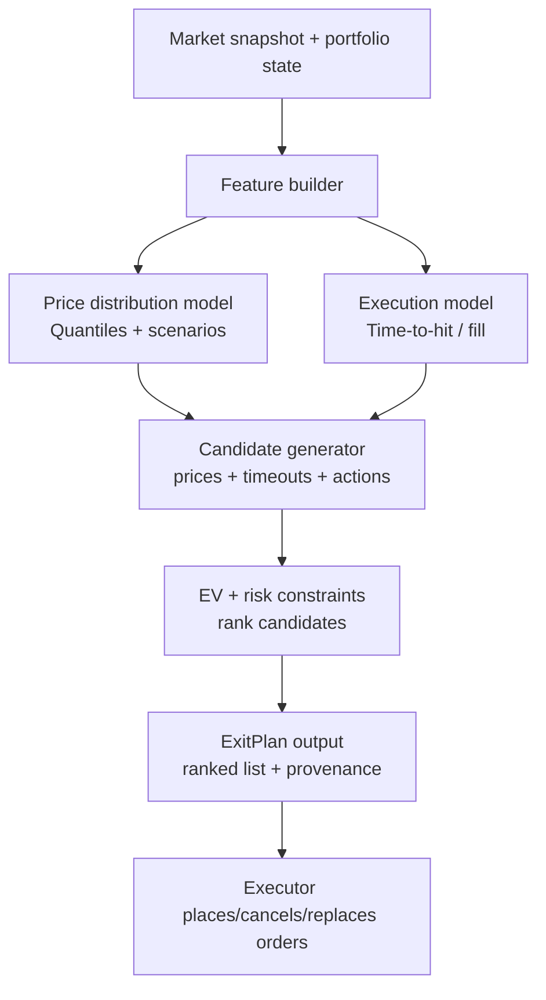
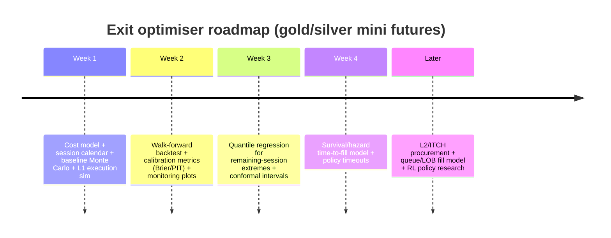

# Quant exit engine design for Avanza gold/silver mini futures intraday scalp bot

## Executive summary

You are building an **exit decision engine**, not a “better sell price finder”. Concretely, `portfolio/exit_optimizer.py` should, for each held mini future (gold/silver first), output a **ranked list of exit candidates** (price, action type, time-to-exit) with **calibrated execution probabilities** and **expected value (EV) in SEK net of costs**, plus the diagnostics needed to audit every recommendation.

Two realities dominate this problem:

First, **execution is probabilistic and microstructure-driven**. For liquidity-provider supported exchange-traded products, trades can be infrequent even when orders can be placed, and Avanza explicitly notes that you can choose to trigger stop-loss behaviour using **market maker quotes instead of trade prints** for selected products—this strongly implies that **quotes, not prints**, may be your most reliable real-time signal for “what is executable”. citeturn8search1

Second, mini futures have **product-specific tail risks** (knock-out/stop-loss and financing level dynamics) that must be model inputs and hard risk constraints. Avanza’s mini futures explainer describes the **stop-loss buffer** concept (commonly around **2–3% above the financing level**, varying with volatility) and notes that after knock-out, the issuer’s ambition is to secure the residual value and then quote a buyback price. citeturn8search0

A robust approach is an **ensemble architecture** with three separable layers:

- **Opportunity layer (price-path distribution):** forecast a *distribution* for remaining-session price outcomes (e.g., remaining-day maximum/minimum or multi-horizon return distribution), not a point estimate. Proper scoring rules make probabilistic accuracy measurable. citeturn0search0  
- **Execution layer (time-to-hit and fill):** convert opportunity into **time-indexed fill probabilities** (e.g., \(P(\text{fill by } \tau)\)), ideally using survival/time-to-event modelling (Cox) for time-to-hit / time-to-fill under censoring at close. citeturn0search6  
- **Decision layer (EV + policy):** enumerate candidate exit actions (limit/marketable/market/cancel/replace), compute EV in SEK net of costs (fees/spread/slippage), apply risk overrides (knock-out proximity, session mismatch, stale quotes), and rank.

Success must be measured with **(i) net economic outcomes** and **(ii) probabilistic calibration**. Calibration is not optional: if your engine ranks exits by EV, then miscalibrated fill probabilities can systematically pick “great” exits that never fill. Proper scoring rules provide the theoretical foundation for evaluating probabilistic forecasts. citeturn0search0 The **Brier score** is a classic proper score for binary events such as “filled within 10 minutes”. citeturn3search2 Density forecast diagnostics such as PIT histograms are widely used to evaluate full predictive distributions. citeturn3search7

## System context and explicit assumptions

Your uploaded docs describe a two-layer architecture: a **Python fast loop** (data + signals, every ~60s) and a separate decision layer. You are now adding a third conceptual component: a **quantitative exit optimiser** that can be called by your agent/decision layer and must return an auditable `ExitPlan`. (This system context is treated as user-provided and therefore **unspecified** by external sources.)

Because several details are not specified, the report makes these explicit assumptions. Any item marked **“unspecified”** should be replaced by your concrete implementation choices.

| Topic | Assumption (if unspecified) | Why it matters |
|---|---|---|
| Available compute | **No specific constraint** | Allows proposing multiple model classes; you can later downshift for latency. |
| Data access to Avanza order book | **Unspecified** (likely limited via broker UI/unofficial endpoints) | Determines whether queue/LOB fill modelling is feasible. |
| Underlying reference | **Unspecified** whether issuer uses spot, futures, or an index; you currently plan to proxy using liquid gold/silver streams | Basis risk and session mismatch must be modelled. |
| Holding size | **Unspecified** (assume retail-like size) | Market impact assumptions differ for small vs large orders. |
| Target horizon | **Intraday; before session end**, with optional extended trading | Exit policy must be time-aware and handle session boundaries. |
| Order types supported | **Unspecified**; assume limit + market + cancel/replace, and that marketable limits can be emulated | Determines action space for optimisation. |
| Fee schedule | **Unspecified**; assume Avanza courtage class applies unless you have a product-specific exemption | EV ranking is sensitive to fee thresholds and minimum fees. citeturn10search1 |

A regulatory framing is useful even if you are not an investment firm. MiFID II defines **algorithmic trading** as trading where a computer algorithm automatically determines key order parameters (initiation, timing, price, quantity, or management after submission) with limited/no human intervention. citeturn14view0 Your bot’s “action recommendations” clearly sit inside that definition conceptually, even if firm-level obligations may not apply to you personally.

## Data requirements and feature engineering

### Data you need

To produce “ranked exits with fill probability and EV”, you need at minimum:

- **Product quotes/trades:** bid/ask (Level 1) with reliable timestamps; trade prints if available.
- **Session calendar:** normal close plus any **extended session** rules for the specific market segment and instrument.
- **Cost model:** courtage/fees, plus empirical spread/slippage estimates.
- **Underlying + FX context:** for gold/silver mini futures, you want a liquid proxy for the underlying plus USD/SEK for valuation, stress tests, and regime features.

The ideal dataset includes **Level 2 / market-by-order** order book events so you can model queue position and true fill probability. Nasdaq explicitly markets **Nordic Equity TotalView-ITCH** as full depth-of-book “market-by-order” access (ultra-low latency feed), with aggregated alternatives via GCF. citeturn1search7 For research (and sometimes procurement), Aalto Datahub describes an archive of Nasdaq Nordic/Baltic order flow with **all orders and information messages at nanosecond level, from 2010 onward** (availability/licensing must be confirmed for your intended segment). citeturn1search3

For your underlying proxy, Binance’s USDⓈ-M futures market data APIs provide trade/quote depth data; Binance explicitly notes that the order book request returns limited depth and recommends websocket market streams to maintain a local order book. citeturn8search3

For FX, Sveriges Riksbank provides a REST API for rates; critically, they state exchange rates are **indicative and not for transaction purposes**, which is fine for backtest valuation but should not be treated as your execution FX. citeturn8search14

### Market hours and session mismatch

For Swedish-listed warrants/certificates (the broader category in which many leveraged ETPs trade), Nasdaq Nordic notes **evening trading hours until 21:55 CET** on First North Sweden/Finland/Copenhagen, with issuers deciding which instruments are open in the evening. citeturn9search0 You must therefore treat “market close” as **instrument-dependent** (and possibly issuer-dependent), not a single fixed time.

Session mismatch matters in two ways:

- **Information mismatch:** the underlying’s primary market may be closed while the product still has quotes.
- **Risk mismatch:** volatility and spreads can change materially in extended hours; the same exit price may have a very different fill probability.

Your optimiser should compute and propagate: `session_end_ts`, `is_extended_session`, and `underlying_session_state` (open/closed/unknown), and expand prediction intervals when mismatch is present.

### Execution costs and fees

Your EV must incorporate brokerage fees and minimum fees. Avanza publishes courtage classes and explains that prices shown apply for certain venues (e.g., Stockholm exchange and First North for most classes) and refers users to a broader price list for other instruments/venues. citeturn10search1 For an exit optimiser, the minimum-fee discontinuities are important: a “small improvement” in price may be more than wiped out by courtage and spread.

### Feature engineering for intraday exits

A good exit engine needs two families of features: **price-opportunity** (will we reach \(p\)?) and **fill/execution** (can we transact at \(p\) in time?).

**Microstructure and execution features (highest leverage if you have L1/L2)**  
Order Flow Imbalance (OFI) is a canonical short-horizon feature: Cont, Kukanov & Stoikov show that over short intervals, price changes are mainly driven by OFI at best bid/ask and find a linear relation between OFI and price changes, with slope inversely proportional to depth. citeturn4search7 For exit optimisation, OFI-style features improve estimates of whether a passive exit will be “run over” or “lifted”.

Other execution features:
- spread (ticks and bps), spread regime
- top-of-book depth and apparent liquidity stability
- quote age / staleness (especially important for LP products; Avanza’s quote-trigger stop-loss support implies quotes can be the operative signal) citeturn8search1
- volatility-of-spread and cancellation intensity (if L2)

**Price-path and regime features**  
Intraday volatility is strongly seasonal. Andersen & Bollerslev document pervasive intraday periodicity and volatility persistence; ignoring periodicity can distort high-frequency dynamics. citeturn5search0 Incorporate:
- realised volatility at multiple horizons (e.g., 1m/5m/15m)
- time-of-day volatility multipliers (learned per instrument)
- momentum and mean reversion factors (multi-horizon returns; RSI/EMA gaps)
- VWAP distance and VWAP slope (if intraday volume is available)
- time-to-close / time-to-extended-close

## Modelling approaches for exit targets and fill probabilities

The exit engine requires two probabilistic objects: (i) a distribution over future prices or future extremes (remaining-session max/min), and (ii) a time-indexed probability of execution given a chosen order and time policy. Below are the requested modelling families; each includes assumptions, inputs, training, expected performance, pros/cons, and suggested hyperparameters. Where performance is mentioned, it is qualitative because your data and execution constraints are **unspecified**.

**Parametric Monte Carlo (stochastic range / scenario simulation)**  
Assumptions: short-horizon returns can be approximated by a parametric process (e.g., conditional Gaussian/t with time-varying volatility); intraday volatility seasonality exists and should be modelled. citeturn5search0turn5search1  
Inputs: recent returns (ticks or bars), current spread/quotes, time-to-close, optional underlying/FX returns.  
Training: estimate conditional volatility (e.g., GARCH family) and intraday seasonal factors; Bollerslev’s GARCH provides a classic framework for conditional heteroskedasticity. citeturn5search1  
Expected performance: strong baseline; robust when data is limited; weak during jumps/news and when microstructure dominates.  
Pros/cons: transparent, fast, easy to stress test; but can be miscalibrated in regime shifts and does not directly model queue fills.  
Suggested hyperparameters: 2k–20k paths; timestep 1–60s; volatility lookback 1–10 trading days; heavy-tail option (Student-t) for scenario robustness.

**Quantile regression (direct quantiles of remaining-session max/min or multi-horizon returns)**  
Assumptions: conditional quantiles are stable enough out-of-sample with walk-forward retraining; features capture time-of-day effects. citeturn5search0turn0search1  
Inputs: feature matrix (microstructure + TA + seasonality + underlying), target definition (e.g., remaining-session max for sell targets; remaining-session min for buy targets).  
Training: minimise quantile loss; Koenker & Bassett introduced regression quantiles (quantile regression) as a generalisation of sample quantiles to linear models. citeturn0search1 Practically, gradient-boosted trees are often competitive on tabular features.  
Expected performance: typically very strong for “price target levels with stated quantiles” when enough history exists; may degrade under strong non-stationarity.  
Pros/cons: outputs tradable levels and uncertainty directly; but quantile crossing and calibration drift are common.  
Suggested hyperparameters: quantiles at {0.05, 0.10, 0.20, 0.35, 0.50, 0.65, 0.80, 0.90, 0.95}; learning rate 0.03–0.1; 500–5000 trees with early stopping; monotonic constraints where appropriate (e.g., fill probability vs aggressiveness).

**Survival analysis (time-to-hit and time-to-fill with censoring)**  
Assumptions: event times (hit/fill) can be treated as time-to-event with censoring at close; covariates affect hazard in a learnable way.  
Inputs: event-labelled samples: at time \(t_0\), define “hit level \(p\) within horizon/close” and/or “fill within horizon”; include covariates (spread, OFI, vol, time-to-close).  
Training: Cox proportional hazards model is the canonical semi-parametric approach to modelling hazard as covariates times an unknown baseline hazard. citeturn0search6 Discrete-time hazard models (logit per bucket) are often easier to engineer.  
Expected performance: excellent for producing time-to-fill curves (\(P(T \le \tau)\)), directly matching your requirement for time-to-exit recommendations.  
Pros/cons: natural handling of censoring and timeouts; but “proportional hazards” may not always hold, and fill labels are only as good as your execution simulator.  
Suggested hyperparameters: time bucket 5–60s (match data cadence); L2 regularisation; include interactions with time-to-close.

**Queue / limit order book (LOB) models for fill probability**  
Assumptions: order arrivals, cancellations, and executions are approximately stochastic point processes whose intensities depend on book state; queue position matters.  
Inputs: L2 order book events (market-by-order or depth updates) and your simulated position in the queue at price \(p\).  
Training/estimation: Cont, Stoikov & Talreja propose a continuous-time stochastic model for limit order book dynamics designed to balance empirical realism, estimability, and analytical tractability. citeturn0search3 Estimate event intensities conditional on state and compute first-passage style fill probabilities (queue depletion before timeout).  
Expected performance: best-in-class for true fill probabilities when you have high-quality L2; likely overkill without it.  
Pros/cons: most realistic execution modelling; but highest data engineering cost and segment-specific quirks (LP-driven books) can break generic assumptions.  
Suggested hyperparameters: state features: spread (ticks), depth at best levels, OFI-type imbalance; intensity model: Poisson regression or gradient boosting; recalibration weekly/monthly.

**Bayesian / Kalman filtering (state-space forecasting + uncertainty)**  
Assumptions: latent states (drift/level/vol) evolve smoothly; observation noise is modelled; regime adaptation is continuous rather than discrete.  
Inputs: price/returns stream, optional exogenous drivers (underlying/FX), time-of-day.  
Training: set up a state-space model and infer latent states online; Kalman (1960) provides the foundational linear state estimation framework. citeturn4search1  
Expected performance: strong for stable intraday adaptation and producing well-behaved uncertainty; may underreact to jumps unless extended (e.g., particle filtering, heavy tails).  
Pros/cons: principled uncertainty and interpretability; but model misspecification risk.  
Suggested hyperparameters: process noise scaling by time-of-day; observation noise estimated from spread regime; robust filtering options (Huber/Student-t) if implemented.

**Hidden Markov Models / Markov switching regimes**  
Assumptions: market alternates among a small number of regimes (trend/chop/high-vol) with Markov transitions.  
Inputs: returns + volatility + possibly microstructure; output regime probabilities used as features/gating.  
Training: fit regime-switching model; Hamilton (1989) introduced a tractable Markov switching approach for regime changes in time series. citeturn4search6  
Expected performance: helpful as a stabilising “meta-feature” or mixture-of-experts gate; rarely sufficient alone for execution.  
Pros/cons: improves robustness and interpretability; may lag and overfit if too many regimes.  
Suggested hyperparameters: 2–4 regimes; refit daily/weekly; enforce minimum regime duration.

**Deep learning sequence models (LSTM, Transformer, TFT)**  
Assumptions: you have enough consistent intraday history to learn non-linear temporal patterns; labels are well-defined and leakage-controlled.  
Inputs: sequences (returns, spreads, OFI, volume, underlying/FX, calendar embeddings).  
Training: supervised multi-horizon probabilistic forecasting.  
- LSTM: Hochreiter & Schmidhuber’s Long Short-Term Memory architecture addresses long-term dependency issues in RNNs. citeturn4search8  
- Transformer: Vaswani et al. propose the Transformer architecture based solely on attention (“Attention Is All You Need”). citeturn1search4  
- TFT: Lim et al. propose the Temporal Fusion Transformer for interpretable multi-horizon forecasting. citeturn7search3  
Expected performance: can outperform trees if dataset is large and stable; frequently underperforms without strong regularisation and proper evaluation due to leakage and regime changes.  
Pros/cons: powerful modelling of interactions; but heavier ops burden and calibration challenges.  
Suggested hyperparameters (starting points, no specific constraint):  
- LSTM: hidden 64–256, layers 1–3, dropout 0.1–0.3, sequence length 256–2048 steps  
- Transformer: d_model 64–256, heads 4–8, layers 2–6, dropout 0.1–0.2  
- TFT: hidden 32–256, heads 4–8, quantile outputs for {0.05…0.95}

**Diffusion models for probabilistic time-series forecasting**  
Assumptions: scenario generation via diffusion can approximate the conditional distribution of future paths; you have ample data to train.  
Inputs: multivariate time series; optionally trained across many related series.  
Training: diffusion-based probabilistic forecasting; Rasul et al. propose TimeGrad (autoregressive denoising diffusion) for multivariate probabilistic forecasting. citeturn6search3  
Expected performance: potentially strong scenario quality; often not worth it until baselines are solid, due to complexity and inference cost.  
Pros/cons: rich scenario generation usable for EV under policies; high complexity, hard calibration, heavy compute.  
Suggested hyperparameters: diffusion steps 50–200; noise schedule (cosine/linear); seqlen 256–1024; train across multiple instruments if possible.

**Reinforcement learning (RL) for execution policy / optimal stopping**  
Assumptions: the exit problem is a sequential decision process (MDP) where actions (limit/market/cancel/replace) affect future state; a realistic simulator exists.  
Inputs: a trading environment simulator with microstructure; state features (spread, depth, inventory, time-to-close), actions, rewards (net SEK P&L with penalties).  
Training: RL on simulated environment; Nevmyvaka, Feng & Kearns present an early large-scale empirical application of RL to optimised trade execution using millisecond LOB data. citeturn6search0  
Expected performance: can learn nuanced policies (when to shade orders, when to cross), but only if the simulator matches real execution.  
Pros/cons: directly optimises policy rather than a forecast metric; but extremely sensitive to simulator mismatch and prone to learning exploitative artefacts.  
Suggested hyperparameters: start with conservative algorithms (e.g., DQN/PPO) and strong reward shaping; action throttling; strict reality-check evaluation. Use RL as phase-two after your execution simulator is credible. citeturn6search0

## Calibration, backtesting, and statistical evaluation

### Calibration and uncertainty quantification

You need uncertainty for both **price-path outcomes** and **execution probabilities**.

- **Proper scoring rules** are the correct objective for probabilistic forecasts. Gneiting & Raftery provide a key treatment of strictly proper scoring rules and their role in prediction and estimation. citeturn0search0  
- **Brier score** (Brier, 1950) is a classic proper scoring rule for probabilistic binary events (e.g., fill/no-fill by time). citeturn3search2  
- **CRPS** is widely used for continuous distribution forecasts; in practice it scores the full predicted CDF against the realised value (useful for predicted remaining-session extremes). (CRPS is discussed in the forecasting literature; you can treat it as part of the proper scoring rules toolkit anchored in the proper-scoring-rule framework.) citeturn0search0  
- **PIT histograms** are a standard diagnostic for density forecasts; Diebold, Gunther & Tay discuss density forecast evaluation methods. citeturn3search7  
- **Conformal prediction** provides distribution-free prediction intervals under weaker assumptions; Xu & Xie propose conformal prediction methods for time series (including EnbPI) without requiring exchangeability. citeturn7search0turn7search19

Practical recommendation: treat calibration as a *separate layer*.
- For event probabilities (fill by time), apply **isotonic regression** or similar post-hoc calibration on out-of-sample predictions (then re-check Brier and reliability curves).
- For continuous targets (max/min), wrap your predictive model with **conformal intervals** to stabilise coverage under drift. citeturn7search0turn7search19

### Backtesting methodology that avoids false confidence

Backtesting an exit engine is unusually prone to **execution optimism** and **data snooping**. White’s “Reality Check” provides a procedure for testing whether the best model found in a search is genuinely superior to a benchmark, accounting for data snooping. citeturn1search2

Minimum backtest standards:

- **Walk-forward evaluation** (rolling train → test windows) to respect temporal ordering.
- **Nested cross-validation** for hyperparameter selection (avoid tuning on the test window).
- **Purged CV / embargoing** when labels overlap time (common in finance). López de Prado’s *Advances in Financial Machine Learning* is the canonical reference for these finance-specific CV ideas; multiple implementations explicitly attribute their designs to this book. citeturn2search7turn15search8turn15search3  
- **Realistic execution simulation**:
  - trade against bid/ask, not mid;
  - include partial fills, cancels, timeout policies;
  - include spread/slippage penalties that worsen in high-volatility and near close.

Also include **PBO (probability of backtest overfitting)**-style thinking; Bailey et al. analyse backtest overfitting and selection risk in investment simulations. citeturn2search6

### Statistical tests, block bootstrap, and confidence intervals

Because returns and execution outcomes are autocorrelated, use time-series aware resampling:

- **Block bootstrap** for stationary dependent sequences: Künsch extends bootstrap/jackknife ideas to general stationary observations (block-based methods). citeturn3search0  
- **Stationary bootstrap**: Politis & Romano introduce a stationary bootstrap procedure for weakly dependent stationary observations. citeturn3search5  

These methods let you form confidence intervals for metrics such as net P&L, fill rate, and calibration scores without assuming IID.

## Risk controls, sizing, latency, and regulatory/ethical constraints

### Risk controls and position sizing

Because mini futures can be knocked out, the exit optimiser must include **hard risk overrides**:
- If distance-to-stop-loss (in product or mapped underlying units) breaches a threshold, prefer de-risking actions (marketable limit/market) over passive profit-taking. The presence of stop-loss buffers and knock-out mechanics is central to mini futures. citeturn8search0  
- Global kill switches: max loss per trade/day (SEK), max inventory time, max order count per minute.

Sizing:
- Kelly criterion is a classic theoretical sizing rule for maximising long-run growth; Kelly (1956) ties optimal betting fractions to information and growth rates. citeturn5search6  
In practice for leveraged ETP scalps, you should use **fractional Kelly with strong caps** (e.g., 0.05–0.25 Kelly) because edge and tail risk are highly unstable (and “unspecified” for your strategy).

### Latency and deployment constraints

Even if your system loop is every 60 seconds, an exit optimiser must be able to react quickly near close and during volatility spikes.

Design constraints (recommended):
- deterministic runtime bounds (timeouts)
- graceful degradation: if L2 is missing, fall back to L1-crossing execution model; if market data is stale, default to “do nothing / cancel / marketable exit depending on risk”
- strict separation between:
  - model inference (can be async and cached)
  - decision-time ranking (must be fast and side-effect free)

## API design, auditability, model/data comparison, and implementation roadmap

### Auditability requirement for `ExitPlan` outputs

Treat auditability as a first-class requirement, not optional metadata. Recommended minimum fields (alongside ranked candidates):

- `asof_ts` and market data timestamps used
- `data_provenance`: sources (Avanza quote stream vs Nasdaq feed vs Binance), staleness flags
- `model_versions`: price model, execution model, calibration model (hashes/semver)
- `calibration_window`: date range used for calibration
- `cost_model`: courtage class/fee schedule version, slippage assumptions
- `diagnostics`: key intermediate probabilities (hit vs fill), uncertainty bands, risk flags

This aligns with the spirit of MiFID II’s emphasis on recordkeeping and controllability for algorithmic trading systems. citeturn13view1turn14view0

### Recommended ensemble architecture

A practical, high-value architecture for your first gold/silver mini future release:

1) **Price distribution module**  
Primary: quantile regression model for remaining-session max/min (or for multi-horizon returns), retrained walk-forward; grounded in quantile regression theory. citeturn0search1  
Fallback: parametric Monte Carlo with intraday seasonality + conditional volatility (GARCH-style). citeturn5search0turn5search1  

2) **Time-to-hit / time-to-fill module**  
Phase one (L1-only): survival/hazard model for time-to-hit; approximate fill using spread-crossing rules. citeturn0search6  
Phase two (L2): queue-based fill probability from LOB event intensities (Cont/Stoikov/Talreja framework as anchor). citeturn0search3  

3) **Policy/ranking module**  
Enumerate candidate exits and associated actions; compute EV net fees/spread/slippage; apply risk overrides (knock-out proximity; session mismatch; stale quotes). Mini futures risk constraints should explicitly incorporate stop-loss mechanics. citeturn8search0turn9search0  

4) **Calibration wrapper**  
Event probability calibration (Brier/reliability) + conformal intervals for distribution forecasts. citeturn0search0turn3search2turn7search0turn7search19  

### Candidate models and data sources comparison table

| Model / component | What it outputs for exit optimisation | Minimal market data needed | “Best” market data | Data source options (examples) | Key strengths | Key risks |
|---|---|---|---|---|---|---|
| Parametric Monte Carlo | \(P(\text{reach }p)\), distribution of remaining-session max/min; scenarios | Intraday bars, session clock | Tick returns + seasonality | Underlying streams (e.g., Binance futures) citeturn8search3 | Fast, robust baseline, easy stress testing | Miscalibration in regime jumps; ignores queue |
| Quantile regression | Direct quantiles of remaining-session max/min or future returns | Features + labels from history | Rich features incl. quotes | Any historical OHLCV + engineered features (conceptual) citeturn0search1 | Direct “levels with probabilities” | Quantile crossing; drift |
| Survival/hazard | \(P(\text{fill by } \tau)\) curves; expected time-to-fill | Event labels; L1 quotes | Tick + microstructure | L1 Avanza quotes (if available), plus accurate timestamps | Time-aware, handles censoring at close citeturn0search6 | Needs honest event definitions |
| Queue/LOB | True fill probability conditioned on queue position | L2 order book depth or events | Market-by-order events | Nasdaq TotalView-ITCH / GCF (if licensed) citeturn1search7turn1search3 | Realistic execution modelling | Data engineering heavy; LP quirks |
| Bayesian/Kalman | Online posterior predictive distribution; adaptive uncertainty | Price/returns stream | Tick + exogenous drivers | Any feed with consistent timestamps citeturn4search1 | Stable online updates | Misspecification; jumps |
| HMM/Regime switching | Regime probabilities to gate risk and aggressiveness | Returns + volatility | Returns + OFI | Any consistent history citeturn4search6 | Stabilises decisions | Lag/overfit regimes |
| LSTM/Transformer/TFT | Multi-horizon probabilistic forecasts (quantiles) | Large history | Large multivariate history | Depends on your dataset; Transformers/TFT are standard architectures citeturn1search4turn7search3turn4search8 | Captures nonlinear temporal patterns | Harder to evaluate; calibration often weak |
| Diffusion (TimeGrad) | Scenario paths / probabilistic forecasts | Very large history | Very large multivariate history | Research-grade; TimeGrad reference citeturn6search3 | Rich scenario generation | Complexity and inference cost |
| RL execution policy | Policy mapping state→action (limit/market/cancel/replace) | High-fidelity simulator | L2-driven simulator | Trade execution RL reference citeturn6search0 | Directly optimises policy | Simulator mismatch; can learn bad behaviours |

Recommended dataset procurement priorities:
- **Nasdaq Nordic TotalView/ITCH:** for full depth/order events (paid/licensed) and possibly via research archives; TotalView suite description and ITCH archive reference. citeturn1search7turn1search3  
- **Avanza access (unofficial) with disclaimer:** community libraries explicitly label the API as unofficial/proof-of-concept and warn it can change without warning. citeturn9search2turn9search10  
- **Binance underlying proxy feeds:** order book updates via websocket market streams recommended. citeturn8search3  
- **Riksbank FX:** useful for valuation/backtest; rates are indicative, not transactional. citeturn8search14  

### Suggested Python function signatures and pseudocode

Below is a concrete, testable interface that matches your required outputs (ranked exits with probabilities, EV SEK, time-to-exit, recommended action) and enforces auditability.

```python
# portfolio/exit_optimizer.py

from __future__ import annotations
from dataclasses import dataclass
from datetime import datetime
from enum import Enum
from typing import Any, Dict, List, Optional, Sequence, Tuple

class Action(str, Enum):
    LIMIT = "limit"
    MARKETABLE_LIMIT = "marketable_limit"  # cross spread with protection
    MARKET = "market"
    CANCEL = "cancel"
    REPLACE = "replace"                    # cancel + new order

@dataclass(frozen=True)
class MarketSnapshot:
    asof_ts: datetime
    bid: Optional[float]
    ask: Optional[float]
    last: Optional[float]
    last_ts: Optional[datetime]
    # Optional depth / L2
    book: Optional[Dict[str, Any]] = None
    # External context (optional)
    xau_usd: Optional[float] = None
    xag_usd: Optional[float] = None
    usdsek: Optional[float] = None
    features: Optional[Dict[str, float]] = None

@dataclass(frozen=True)
class Position:
    symbol: str
    qty: int                     # >0 long, <0 short
    avg_entry: float             # SEK
    opened_ts: datetime

@dataclass(frozen=True)
class InstrumentRules:
    symbol: str
    currency: str                # expected "SEK"
    tick_size: float
    session_end: datetime
    extended_end: Optional[datetime] = None
    stop_loss_level: Optional[float] = None
    financing_level: Optional[float] = None

@dataclass(frozen=True)
class CostModel:
    courtage_bps: float
    min_fee_sek: float
    slippage_bps: float
    spread_cost_model: str       # e.g. "cross_spread", "half_spread", "empirical"

@dataclass(frozen=True)
class CandidateExit:
    price: float
    action: Action
    good_till: datetime
    fill_prob: float                  # P(fill by good_till), calibrated
    expected_fill_time_s: float        # E[T_fill] capped at horizon
    expected_pnl_sek: float            # conditional on fill
    expected_value_sek: float          # includes fallback if not filled
    risk_flags: Tuple[str, ...]
    diagnostics: Dict[str, Any]        # REQUIRED: provenance + model versions + key intermediates

@dataclass(frozen=True)
class ExitPlan:
    symbol: str
    asof_ts: datetime
    position_qty: int
    ranked: List[CandidateExit]
    recommended: CandidateExit
    provenance: Dict[str, Any]         # REQUIRED: feed ids, staleness checks, model versions, calibration window

def compute_exit_plan(
    position: Position,
    market: MarketSnapshot,
    rules: InstrumentRules,
    costs: CostModel,
    models: Dict[str, Any],
    *,
    max_candidates: int = 12,
) -> ExitPlan:
    """
    Pure function: no network, no side effects.
    Must never return NaN probs; must return risk_flags and provenance.
    """
    ...
```

Backtest execution simulator (two modes: L1 conservative and L2 queue-aware):

```python
def simulate_execution(
    *,
    action: str,
    limit_price: float | None,
    qty: int,
    start_ts: datetime,
    end_ts: datetime,
    market_events: Sequence[dict],
    tick_size: float,
    mode: str = "l1_crossing",     # "l2_queue" when you have ITCH/L2
    slippage_bps: float = 0.0,
    require_penetration_ticks: int = 0,
) -> dict:
    """
    Returns realised fills for a hypothetical order policy.
    Must support censoring at end_ts and partial fills.
    """
    ...
```

### Unit and integration tests to prioritise

- **Probability sanity:** more aggressive sell exits should not have lower predicted fill probability (monotonicity checks).
- **Calibration invariants:** no candidate may have `fill_prob` outside [0, 1]; calibration bucket tests should reproduce expected empirical frequencies.
- **Session boundary tests:** `good_till` must not exceed `session_end`/`extended_end` depending on instrument. Extended evening trading is instrument- and issuer-dependent. citeturn9search0  
- **Mini-future risk override tests:** near stop-loss buffer → must recommend de-risk action (marketable/market). citeturn8search0  
- **Auditability tests:** output must include model versions and data provenance; missing provenance is a hard failure (aligns with MiFID-style recordkeeping principles). citeturn13view1  

### Monitoring and retraining

Monitoring should include both **economic** and **probabilistic** KPIs:
- Reliability diagram + Brier score trend for events like “filled within 5m/15m/before close”. citeturn3search2  
- PIT histograms for distribution forecasts (remaining-session max/min). citeturn3search7  
- Drift metrics on spread regimes and time-of-day volatility patterns (intraday periodicity is material). citeturn5search0  
- Weekly walk-forward backtest replay with White reality check when comparing new vs old model bundles. citeturn1search2  

### Requested evaluation visualisations

Produce these charts per instrument and per regime:
- **Reliability diagram** (fill probability calibration) + Brier score over time. citeturn3search2  
- **PIT histogram** for predictive distributions (max/min or returns). citeturn3search7  
- **EV frontier:** exit price vs fill probability vs expected value (SEK), highlighting recommended point.
- **Time-to-fill curves:** \(P(T \le \tau)\) across \(\tau\) for top candidates (survival output). citeturn0search6  
- **Cumulative net P&L** and drawdown curves (with transaction costs).
- **Block-bootstrap confidence intervals** around key metrics (net P&L, hit rate) to avoid IID assumptions. citeturn3search0turn3search5  

### Mermaid diagrams requested

System flow:



Timeline:



### Prioritised implementation roadmap with effort and dependencies

Effort estimates are rough and assume **no specific constraint** on compute, but acknowledge that data procurement/licensing may dominate.

| Milestone | Deliverable | Effort | Dependencies | Key risks |
|---|---|---:|---|---|
| Define contracts | `ExitPlan`, `CandidateExit`, provenance schema; cost model interface | 0.5–1 day | None | Missing provenance makes later debugging impossible |
| Calendar & session logic | Instrument-specific `session_end`/`extended_end`, session mismatch flags | 1–2 days | Source of trading hours; per-instrument rules | Extended trading differs by instrument/issuer citeturn9search0 |
| Baseline exit engine | Monte Carlo opportunity model + candidate generator + EV ranking | 2–4 days | Historical bars; fee assumptions | Miscalibration if you ignore intraday seasonality citeturn5search0 |
| Conservative execution sim | L1-crossing fill model with buffers; partial fill stub | 2–4 days | L1 bid/ask history | Overestimates fill if too optimistic |
| Evaluation suite | Reliability, PIT, EV frontier, time-to-fill reporting | 2–5 days | Backtest runner | Without calibration, EV ranking is unsafe citeturn0search0turn3search2 |
| Quantile regression upgrade | Remaining-session max/min quantiles + drift-aware retrain | 3–7 days | Feature store; walk-forward framework | Leakage and non-stationarity |
| Conformal calibration | Conformal intervals / coverage monitoring | 2–4 days | Quantile model outputs | Requires clean time-series splits citeturn7search0turn7search19 |
| Survival time-to-fill | Fill probability by time + recommended timeouts | 4–10 days | Event labels + simulator | Event definition quality citeturn0search6 |
| L2/ITCH path | Queue model + state-dependent fill probability | 2–8 weeks | Nasdaq data licensing or research access citeturn1search7turn1search3 | Data cost/coverage; complexity |
| RL research track | Policy learning on validated simulator | 2–6 weeks (R&D) | High-fidelity simulator; safe constraints | Simulator mismatch; unsafe behaviours citeturn6search0 |

## Limitations and practical caveats

- Predicting the exact intraday high/low is not reliably achievable; a production-quality exit engine should predict **distributions** and operate on **calibrated probabilities**, scored with proper scoring rules and diagnostics like PIT. citeturn0search0turn3search7  
- Without L2/order-book events, fill probability estimation is necessarily approximate; queue-based models become credible only with detailed order events (e.g., TotalView-ITCH style feeds). citeturn1search7turn0search3  
- Mini futures embed knock-out dynamics; risk management must override EV-seeking near stop loss/financing boundaries. citeturn8search0  
- If you rely on unofficial Avanza endpoints, treat them as operationally fragile: the library documentation explicitly calls the API unofficial, proof-of-concept, and warns it can change without warning. citeturn9search2turn9search10  
- Regulatory obligations differ by whether you are an investment firm, but MiFID II’s definition of algorithmic trading and emphasis on controls/records is a strong design template for auditability and safe deployment. citeturn14view0turn13view1turn12search0turn11search0

## References

[1] Vad innebär Stop Loss på Market Maker Quotes? - Avanza
https://www.avanza.se/kundservice.html/5042/vad-innebar-stop-loss-pa-market-maker-quotes

[2] Hur fungerar mini futures? - Avanza
https://www.avanza.se/lar-dig-mer/avanza-akademin/borshandlade-produkter/hur-fungerar-mini-futures.html

[3] Strictly Proper Scoring Rules, Prediction, and Estimation - Gneiting & Raftery (2007, JASA)
https://www.stat.washington.edu/raftery/Research/PDF/Gneiting2007jasa.pdf

[4] Regression Models and Life-Tables - D. R. Cox (1972, JRSS)
https://web.stanford.edu/~lutian/coursepdf/cox1972paper.pdf

[5] Verification of Forecasts Expressed in Terms of Probability - Brier (1950, Monthly Weather Review)
https://journals.ametsoc.org/view/journals/mwre/78/1/1520-0493_1950_078_0001_vofeit_2_0_co_2.xml

[6] Evaluating Density Forecasts - Diebold, Gunther & Tay (NBER)
https://www.nber.org/papers/t0215

[7] Courtageklasser och priser - Avanza
https://www.avanza.se/konton-lan-prislista/prislista/courtageklasser.html

[8] MiFID II Article 4 Definitions - ESMA
https://www.esma.europa.eu/publications-and-data/interactive-single-rulebook/mifid-ii/article-4-definitions

[9] Nasdaq Nordic Equity TotalView Suite
https://www.nasdaq.com/solutions/nordic-equity-totalview-suite

[10] Nasdaq Nordic Equity TotalView - ITCH Market Feed - Aalto Datahub
https://datahub.aalto.fi/en/data-sources/nasdaq-nordic-equity-totalview-itch-market-feed

[11] Binance USDⓈ-M Futures Order Book API
https://developers.binance.com/docs/derivatives/usds-margined-futures/market-data/websocket-api

[12] Hämta räntor och valutakurser via API - Sveriges Riksbank
https://www.riksbank.se/sv/statistik/rantor-och-valutakurser/hamta-rantor-och-valutakurser-via-api/

[13] Warrants & Certificates - Nasdaq Nordic
https://www.nasdaq.com/european-market-activity/warrants-certificates

[14] The Price Impact of Order Book Events - Cont, Kukanov & Stoikov (2014, JFEC)
https://academic.oup.com/jfec/article-abstract/12/1/47/816163

[15] Intraday Periodicity and Volatility Persistence in Financial Markets - Andersen & Bollerslev (1997, J. Empirical Finance)
https://public.econ.duke.edu/~boller/Published_Papers/joef_97.pdf

[16] Generalized Autoregressive Conditional Heteroskedasticity - Bollerslev (1986, J. Econometrics)
https://public.econ.duke.edu/~boller/Published_Papers/joe_86.pdf

[17] Regression Quantiles - Koenker & Bassett (1978, Econometrica)
https://people.eecs.berkeley.edu/~jordan/sail/readings/koenker-bassett.pdf

[18] A Continuous-Time Stochastic Model for Limit Order Book Dynamics - Cont, Stoikov & Talreja (2010, Operations Research)
https://rama.cont.perso.math.cnrs.fr/pdf/CST2010.pdf

[19] A New Approach to Linear Filtering and Prediction Problems - Kalman (1960)
https://www.cs.unc.edu/~welch/kalman/media/pdf/Kalman1960.pdf

[20] A New Approach to the Economic Analysis of Nonstationary Time Series and the Business Cycle - Hamilton (1989, Econometrica)
https://users.ssc.wisc.edu/~behansen/718/Hamilton1989.pdf

[21] Long Short-Term Memory - Hochreiter & Schmidhuber (1997, Neural Computation)
https://www.bioinf.jku.at/publications/older/2604.pdf

[22] Attention Is All You Need - Vaswani et al. (2017, NeurIPS)
https://papers.neurips.cc/paper/7181-attention-is-all-you-need.pdf

[23] Temporal Fusion Transformers for Interpretable Multi-horizon Time Series Forecasting - Lim et al. (2021)
https://arxiv.org/abs/1912.09363

[24] Autoregressive Denoising Diffusion Models for Multivariate Probabilistic Time Series Forecasting - Rasul et al. (TimeGrad, 2021)
https://arxiv.org/abs/2101.12072

[25] Reinforcement Learning for Optimized Trade Execution - Nevmyvaka, Feng & Kearns
https://www.cis.upenn.edu/~mkearns/papers/rlexec.pdf

[26] Conformal Prediction for Time Series - Xu & Xie (2021)
https://arxiv.org/abs/2010.09107

[27] A Reality Check for Data Snooping - White (2000, Econometrica)
https://users.ssc.wisc.edu/~behansen/718/White2000.pdf

[28] Advances in Financial Machine Learning - López de Prado (2018, Wiley)
https://books.google.com/books/about/Advances_in_Financial_Machine_Learning.html?id=oU9KDwAAQBAJ

[29] The Probability of Backtest Overfitting - Bailey et al. (2014)
https://escholarship.org/uc/item/4w1110bb

[30] The Jackknife and the Bootstrap for General Stationary Observations - Künsch (1989, Annals of Statistics)
https://www.jstor.org/stable/2241719

[31] The Stationary Bootstrap - Politis & Romano (1994, JASA)
https://www.jstor.org/stable/pdf/2290993.pdf

[32] A New Interpretation of Information Rate - Kelly (1956, Bell System Technical Journal)
https://www.princeton.edu/~wbialek/rome/refs/kelly_56.pdf

[33] MAR Regulation (EU) No 596/2014
https://eur-lex.europa.eu/eli/reg/2014/596/oj/eng

[34] MiFID II Article 17 Algorithmic Trading - ESMA
https://www.esma.europa.eu/publications-and-data/interactive-single-rulebook/mifid-ii/article-17-algorithmic-trading

[35] RTS 6 - Commission Delegated Regulation (EU) 2017/589
https://eur-lex.europa.eu/eli/reg_del/2017/589/oj/eng

[36] ESMA Supervisory Briefing on Algorithmic Trading in the EU (Feb 2026)
https://www.esma.europa.eu/sites/default/files/2026-02/ESMA74-1505669079-10311_Supervisory_Briefing_on_Algorithmic_Trading_in_the_EU.pdf

[37] EU AI Act - Regulation (EU) 2024/1689
https://eur-lex.europa.eu/eli/reg/2024/1689/oj/eng

[38] Avanza unofficial API documentation
https://qluxzz.github.io/avanza/avanza.html
