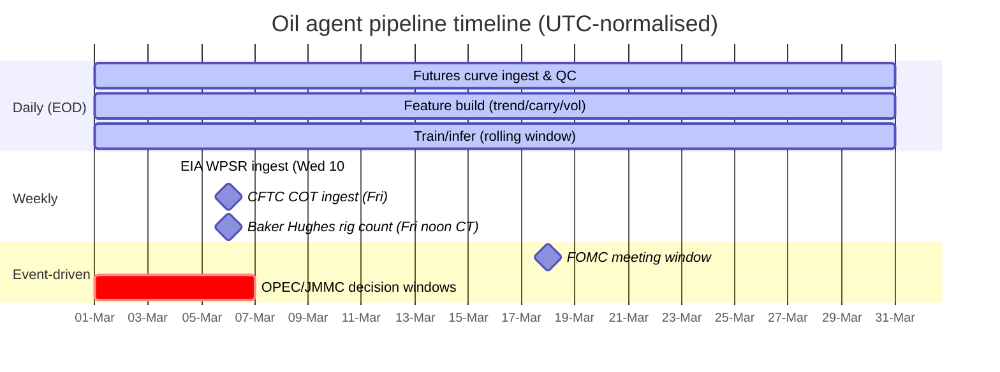

# Oil Price Quant Technical Analysis and Event‑Aware Forecasting Playbook

## Executive summary

Quantitative teams forecasting **oil** (typically **WTI/CL** and **Brent**) rarely rely on “chart-reading” alone. In professional settings, “technical analysis” becomes **measurable, testable signal engineering**, built on (i) **trend/time‑series momentum**, (ii) **term‑structure & carry** (contango/backwardation, calendar spreads), (iii) **volatility/regime modelling**, and (iv) **commodity‑specific fundamentals** (inventories, refinery demand proxies, positioning). These are then combined with **event-aware overlays** for the oil market’s highly scheduled risk (EIA weekly inventories; FOMC; OPEC+/JMMC; IEA monthly reports) and unscheduled shocks (geopolitical disruptions). citeturn3search0turn4search2turn5search1turn0search2turn1search3turn7search1turn6search2

A practical implementation architecture for a local PC should treat oil as a **futures‑curve market**, not a single spot series. For WTI, the **NYMEX Light Sweet Crude Oil futures** contract’s unit of trading is **1,000 U.S. barrels** and the minimum price fluctuation is **$0.01 per barrel** (plus key expiry/last‑trade mechanics), so your system must handle **rolling** and delivery-month constraints correctly. citeturn13view0turn14view0 For Brent, ICE’s contract specification likewise states **1,000 barrels** and **$0.01 per barrel** price quotation, enabling consistent slope/carry feature computation across benchmarks. citeturn8view0turn9view0

The most “worth weighting” signals—because they have strong empirical support and/or strong economic intuition in commodities—are:  
1) **Multi‑horizon time‑series momentum** (1–12 months) and trend measures, robust across futures markets. citeturn3search0  
2) **Carry/term‑structure slope and calendar spreads**, motivated by the **theory of storage** and inventory tightness; commodity returns vary with inventories and basis measures. citeturn4search2turn4search6turn4search3  
3) **Volatility regime signals** (realised + implied like OVX), plus **GARCH-family** volatility forecasts for sizing and risk gating. citeturn18search3turn4search0turn4search5  
4) **Inventory and flow surprises** around EIA’s scheduled release windows (timing is predictable and must be timestamped precisely). citeturn0search2turn1search8  
5) **Event and news features** (FOMC calendars; OPEC communications; geopolitical risk proxies like GPR; uncertainty proxies like EPU) to handle discontinuities and shifting regimes. citeturn1search3turn7search4turn2search0turn2search5

Unspecified items you must decide (not provided in the prompt): exact market‑data vendor(s), licensing/budget, latency requirements (EOD vs intraday), execution venue/broker, slippage/fee model accuracy, and whether you can store/redistribute full‑text news locally (licensing constraints). This playbook is therefore **vendor‑agnostic** but implementation‑ready.

## Scope and purpose

### What “technical analysis” means in quant oil systems

In systematic commodity programmes, “technical analysis” is operationalised as **rules/indicators converted into numeric features**, then **validated by backtests**, often with bootstrap or robust testing to avoid spurious pattern‑finding. Classic work on simple moving‑average and trading‑range breakouts illustrates this approach: define the rule precisely; test against null models; use resampling techniques to assess significance. citeturn3search9turn3search13

In oil, **futures term structure** and inventory conditions are central. Commodity futures returns and risk premia relate to physical inventories (theory of storage) and price measures such as basis and prior returns. citeturn4search2turn4search6 Consequently, “quant TA for oil” is usually TA **plus** curve/fundamental microstructure specific to deliverable commodities.

### Forecasting objectives

Implement **two forecasting layers**:

Short‑term (days → weeks): forecast **returns** (direction + magnitude) and **volatility**; emphasise event windows (EIA, FOMC) and high‑frequency regimes. citeturn0search2turn1search3turn18search3  
Long‑term (months): forecast **monthly returns/levels** with macro/structural drivers; incorporate demand vs supply shock structure (SVAR/Kilian) as features/benchmarks. citeturn3search2turn3search3

### Instruments in scope

Primary benchmarks:  
- **WTI (NYMEX Light Sweet Crude Oil futures)**: trading unit 1,000 barrels; min tick $0.01/bbl; physically deliverable; has explicit trading-termination rules. citeturn13view0turn14view0  
- **Brent (ICE Brent Crude futures)**: contract size 1,000 barrels; $0.01/bbl quotation. citeturn8view0turn9view0

Supporting markets (optional but strongly recommended): refined products (for crack spreads), FX (USD), rates, equity risk.

## Required local datasets and acquisition blueprint

### Core dataset table

| Dataset class | Minimum viable content | Primary/official source(s) | Typical frequency | Access method (local ingestion) | Notes / pitfalls |
|---|---|---|---|---|---|
| WTI futures curve | OHLC/settle, volume, open interest for multiple maturities (e.g., 1–12) | NYMEX rulebook defines contract unit/tick & expiry rules citeturn13view0turn14view0 | Daily (EOD); intraday optional | Vendor feed (unspecified) + local parquet store | Must build **continuous series** with explicit roll logic; avoid delivery/expiry issues |
| Brent futures curve | Same as WTI | ICE Brent contract specification (1,000 bbl, $0.01/bbl) citeturn8view0turn9view0 | Daily | Vendor feed (unspecified) | Needed for Brent–WTI spread; validates global vs US regimes |
| Options & implied vol | Either full option chain for WTI/Brent, or proxy indices | **OVX** is computed from USO options using VIX methodology; circular details constant 30‑day expected vol construction citeturn18search3turn18search2 | Daily/intraday | Pull OVX time series (e.g., from FRED if acceptable) citeturn18search9 | If you can source full options, you can compute skew/event-implied distributions; otherwise use OVX/other indices |
| EIA inventories (WPSR) | Weekly crude stocks, Cushing, refinery inputs/utilisation, imports/exports | WPSR release schedule & timing citeturn0search2; EIA Open Data/API citeturn1search4turn1search8 | Weekly | EIA API pull + release-time stamping | Align to **10:30 ET Wednesday** for the headline tables; holiday shifts matter citeturn0search2 |
| CFTC positioning (COT) | Futures-only or futures+options positions by trader category; net positions & changes | CFTC COT portal + petroleum short reports citeturn1search1turn1search5 | Weekly | Download CFTC files + parse to time series | Use as “crowding/flow” proxy; beware changing report formats over time |
| Baker Hughes rig count | Active rigs by region/type | Baker Hughes rig count site: released weekly at noon CT (last workday) citeturn1search2 | Weekly | Download from Baker Hughes site | Good medium-term supply proxy; response can lag price |
| Crack spreads | 3‑2‑1, 2‑1‑1, product‑crude differentials | CME: crack spread = theoretical refining margin citeturn5search0 | Daily | Compute from futures prices (RB/HO/ULSD vs CL) | Strong demand/refining regime indicator; compute consistently with contract units |
| Macro/event calendars | FOMC meeting dates & statements; OPEC/JMMC decisions; IEA OMR release schedule; EIA release schedule | Fed FOMC calendars citeturn1search3; OPEC press releases citeturn7search4; OPEC+ monitoring cadence “every two months” in press statements citeturn7search1; IEA OMR pages citeturn6search2turn6search10; EIA WPSR schedule citeturn0search2 | Mixed | Scrape + normalise to UTC | OPEC exact **future** dates can be hard to source officially; treat as partially unspecified and infer from announced statements |
| Geopolitical/uncertainty proxies | GPR index + EPU indices | PolicyUncertainty GPR description citeturn2search0; EPU methodology citeturn2search5 | Monthly (often with prelim) | Download CSV + map to trading days | Use as regime features, not day‑trading triggers |
| News corpus | Headlines + full text + metadata; topic labels & sentiment | FinBERT paper citeturn2search2; Loughran–McDonald dictionary citeturn2search3 | Streaming | Feed (unspecified) + local indexing | Licensing unspecified; build deduplication, timestamping, credibility scoring |

### Continuous contracts and roll methods

Oil desks commonly model a **continuous front series** for indicator computation, but trade/PNL must follow actual contracts (with rolls and transaction costs). CME’s “Rolling Futures Indices” methodology describes an index designed to represent “a continuous rolling investment” in an underlying futures contract based on settlement values. citeturn5search2turn5search14

Recommended to implement **at least two roll constructions**:

1) **Calendar roll (rule-based)**
- Roll N business days before expiry/last trade date (contract-specific).
- Pros: stable; common in indices; easy to reproduce.
- Cons: can roll into poor liquidity regimes; may be suboptimal.

2) **Liquidity roll (volume/OI-based)**
- Roll when next contract’s volume (or OI) exceeds front’s by threshold.
- Pros: follows market migration; reduces forced illiquidity.
- Cons: can be noisy; must prevent look‑ahead (use only information available at decision time).

**Why this matters in oil:** deliverable commodities can exhibit extreme behaviour near expiry and storage constraints; the April 2020 negative WTI front-month event is a reminder that liquidity/storage can dominate pricing in stressed regimes. citeturn5search3

### Minimal data model (local storage)

Use a local columnar store (Parquet/Arrow) partitioned by date and symbol:

- `futures_prices`: `date`, `symbol`, `exchange`, `contract_month`, `tenor_k`, `open`, `high`, `low`, `settle`, `volume`, `open_interest`
- `options_surface` (optional): `date`, `underlying`, `expiry`, `strike`, `call_put`, `mid_iv`, `delta`, `gamma`, `vega`, `open_interest`
- `fundamentals_eia`: `release_datetime_utc`, `week_ending`, `series_id`, `value`
- `positioning_cot`: `report_date`, `market_code`, `category`, `long`, `short`, `spreading`, `open_interest`
- `events_calendar`: `event_id`, `event_type`, `event_datetime_utc`, `source`, `importance`
- `news_items`: `published_datetime_utc`, `source`, `headline`, `body`, `hash`, `entities`, `topics`, `sentiment`

## Signal library with equations, notation, and signal priority

### Notation

Use log prices and log returns:

```text
Let P_t be the settlement price (or close) of a tradeable series at time t.
Log return over horizon h (in trading days):
  r_{t,h} = ln(P_t) - ln(P_{t-h})
```

For futures curves, denote the futures price by maturity index \(k\):

```text
Let F_t^(k) be the futures settlement price at time t for the k-th listed maturity
(e.g., k=1 front month, k=2 next month, etc.).
```

### What quants prioritise in oil and why

| Priority | Signal family | Why it is typically high-weight in oil systems |
|---|---|---|
| Highest | Time-series momentum / trend (multi-horizon) | Broad futures evidence for persistence at 1–12 month horizons; core “CTA-style” building block citeturn3search0 |
| Highest | Carry / term structure / calendar spreads | Encodes inventory tightness and storage economics; commodity premia vary with inventories (theory of storage) citeturn4search2turn4search6turn4search3 |
| High | Volatility & regime features (RV + implied + GARCH) | Oil is regime‑switchy and event‑shock driven; volatility models (ARCH/GARCH) are standard; implied vol proxies (OVX) provide market expectations citeturn4search5turn4search0turn18search3 |
| High | Inventories & “surprise” around EIA WPSR | Recurring scheduled catalyst; correct timestamping is crucial (10:30 ET Wednesdays; holiday shifts) citeturn0search2turn1search8 |
| Medium | Positioning (COT), flows, “crowding” | Often useful as secondary/risk signals, especially at extremes; COT provides standardised weekly positioning citeturn1search1turn1search5 |
| Medium | Crack spreads / refined-product complex | Crack spreads proxy refinery margin/demand pull; CME defines crack spread as theoretical refining margin citeturn5search0 |
| Medium | News/NLP & geopolitical/uncertainty proxies (GPR/EPU) | Helps regime identification and event narratives; best used as overlay/risk gating rather than a sole predictor citeturn2search0turn2search5turn2search2turn2search3 |

### Detailed signal definitions and equations

#### Time-series momentum (TSMOM) and trend

Time series momentum is widely documented across futures markets and is typically implemented over multiple horizons. citeturn3search0

```text
Directional TSMOM signal (one horizon L):
  s_t^{tsmom}(L) = sign(r_{t,L})

Multi-horizon aggregation (example):
  S_t^{tsmom} = Σ_{L in {21, 63, 126, 252}} w_L * sign(r_{t,L})
```

Moving average features (avoid fragile “one MA crossover”; use several and/or continuous versions):

```text
Simple moving average:
  MA_t(L) = (1/L) * Σ_{i=0..L-1} P_{t-i}

Crossover strength (continuous):
  x_t^{ma}(L_fast, L_slow) = (MA_t(L_fast) - MA_t(L_slow)) / P_t

Price distance-to-MA (in vol units):
  z_t^{ma}(L) = (ln(P_t) - ln(MA_t(L))) / σ̂_t
```

#### Donchian / trading-range breakout

Trading-range breakout rules are among the simplest classic “TA rules” studied in the academic literature (often alongside moving averages), and are straightforward to implement and backtest. citeturn3search9turn3search13

```text
Donchian channel breakout (lookback L):
  High_t(L) = max_{i=1..L} P_{t-i}
  Low_t(L)  = min_{i=1..L} P_{t-i}

Breakout signal (example):
  s_t^{don}(L) =
    +1  if P_t > High_t(L)
    -1  if P_t < Low_t(L)
     0  otherwise
```

#### Term structure, carry, and calendar spreads

Carry has been formalised as a return predictor across asset classes, and term‑structure measures are central in commodities. citeturn4search3turn4search2turn4search6

Curve slope (log form):

```text
Slope between near and far maturities:
  slope_t(k_near, k_far) = ln(F_t^(k_far)) - ln(F_t^(k_near))
```

Annualised carry proxy (if you know time-to-expiry in years, ΔT):

```text
carry_t = [ln(F_t^(far)) - ln(F_t^(near))] / ΔT
```

Calendar spread level & change:

```text
Calendar spread (near vs next):
  cs_t(1,2) = F_t^(2) - F_t^(1)
  Δcs_t = cs_t - cs_{t-1}
```

#### Roll-yield proxy and futures return decomposition

CME’s roll-yield paper clarifies that roll yield is tied to the difference between futures and spot returns and can materially affect total returns. citeturn5search1

A pragmatic modelling decomposition for a rolled futures index:

```text
Total return over [t-1, t] for a rolling futures position:
  TR_t ≈ PriceReturn_t + RollComponent_t   (financing ignored or modelled separately)

Practical roll proxy (when rolling from contract A to B):
  roll_proxy_t ≈ ln(F_t^B) - ln(F_t^A)
```

Implementation note: This is a **strategy accounting** concept. In modelling, treat roll/carry as features and ensure your PnL engine uses the same roll schedule used to create your continuous series.

#### Inventory level, change, and “surprise”

EIA WPSR timing is explicit: key tables released after **10:30 a.m. Eastern on Wednesdays** (with holiday delays). citeturn0search2 Use the EIA API to pull weekly crude stocks series (e.g., total and Cushing). citeturn1search8turn1search0

```text
Let Inv_t be EIA-reported inventory level (weekly).
Weekly change:
  ΔInv_t = Inv_t - Inv_{t-1}

Seasonal z-score (recommended):
  zInv_t = (ΔInv_t - mean(ΔInv_{t-52..t-1})) / std(ΔInv_{t-52..t-1})

Surprise (if consensus available; otherwise use a model forecast):
  surprise_t = ActualΔInv_t - ConsensusΔInv_t
```

Event-window return labelling around release time:

```text
Define release time τ_t (UTC) for EIA release.
Compute intraday returns r_{τ_t+Δ} - r_{τ_t-Δ} for Δ windows (e.g., 30m, 60m),
or daily close-to-close with correct alignment.
```

#### Realised volatility, implied volatility (OVX), and GARCH

OVX is described in Cboe documentation as a constant 30‑day expected volatility measure derived from options on USO using VIX methodology, with weighting of nearby expiries. citeturn18search3turn18search2

Realised volatility (annualised, daily returns):

```text
RV_t(L) = sqrt( (252/L) * Σ_{i=1..L} r_{t-i,1}^2 )
```

GARCH(1,1): standard baseline for conditional variance forecasting (originating from ARCH and generalised to GARCH). citeturn4search5turn4search0

```text
Mean model:
  r_t = μ + ε_t,   ε_t = σ_t * z_t,   z_t ~ N(0,1) or t_ν

Variance model (GARCH(1,1)):
  σ_t^2 = ω + α * ε_{t-1}^2 + β * σ_{t-1}^2
Constraints: ω>0, α≥0, β≥0, α+β<1
```

Implied–realised spread feature:

```text
iv_rv_spread_t = OVX_t - RV_t(L)   (ensure units aligned: both annualised %)
```

#### Positioning metrics from CFTC COT

CFTC provides weekly COT reports, including petroleum categories. citeturn1search1turn1search5 Build stable, normalised measures:

```text
Net speculative position (example; define category mapping explicitly):
  net_spec_t = long_noncommercial_t - short_noncommercial_t

Normalise by open interest:
  net_spec_oi_t = net_spec_t / open_interest_t

Z-score / percentile (crowding):
  z_spec_t = (net_spec_oi_t - mean(net_spec_oi_{t-260..t-1})) / std(...)
```

Use primarily as:
- a **risk overlay** (extreme crowding + high vol),
- a **regime classifier**,
- a **secondary predictor**.

#### Crack spreads as demand/refining regime proxy

CME defines crack spread as the theoretical refining margin and provides a calculator framework. citeturn5search0 Compute spreads from futures prices:

```text
Example: 3-2-1 crack (illustrative; confirm contract units in your data):
  crack_321_t = 2 * Gasoline_t + 1 * Distillate_t - 3 * Crude_t
Normalise per barrel using contract multipliers to make units consistent.
```

#### News/NLP features (FinBERT + Loughran–McDonald)

FinBERT is a pretrained language model targeting financial sentiment tasks. citeturn2search2 Loughran–McDonald provides financial sentiment word lists and a master dictionary (licensing differs for commercial use). citeturn2search3

Minimal viable NLP feature set:

```text
For each news item i at time t_i:
  - sentiment_fnb_i ∈ [-1, +1]   (FinBERT score mapped to numeric)
  - sentiment_lm_i  ∈ [-1, +1]   (lexicon score: (pos-neg)/len with filters)
  - topic_probs_i   (multilabel: supply disruption, OPEC policy, sanctions, refinery outage, demand shock, etc.)

Aggregate to daily features for instrument j:
  sent_t = EWMA(sentiment_fnb_i, half_life=2d) over items in last 24-72h
  topic_supply_t = EWMA(topic_supply_probs_i, half_life=2d)
  news_volume_t = count(items) or log(1+count)
```

Geopolitical/uncertainty overlays:
- **GPR**: news-based geopolitical risk measure (benchmark index, subindexes for threats/acts). citeturn2search0  
- **EPU**: methodology and indices for policy uncertainty; recommended for slow-moving regime features. citeturn2search5turn2search9

## Modelling stack by horizon and event-aware overlays

### Model families table (what to use where)

| Horizon | Target(s) | Recommended baseline(s) | Recommended main model(s) | Why |
|---|---|---|---|---|
| 1–5 trading days | return, direction, RV | random walk; AR(1) returns; simple MA/Donchian; naive vol | Gradient-boosted trees (GBTs); regularised linear/logistic | GBTs handle non-linear interactions between event flags, curve shape, vol, and trend without heavy feature scaling |
| 5–20 trading days | return + vol regime | TSMOM-only; carry-only; GARCH vol | GBTs + regime classifier (HMM/Markov switching optional) | Oil often changes regime around inventory/news shocks—explicit regime features reduce overfitting |
| 1–12 months | monthly returns/levels | seasonal naive; linear carry/trend; STEO/IEA as benchmark | VAR/SVAR features + elastic net; ensemble with carry/trend | Macro causes matter; Kilian-style decomposition helps separate supply vs demand shocks citeturn3search2turn3search3 |

### Baselines you must implement (anti-overfitting)

Implement these in code and always report them in evaluation:

- **No-change / random walk** baseline for prices.
- **Zero-mean returns** baseline for returns.
- **TSMOM-only** (multi-horizon sign) as a strong “simple” benchmark. citeturn3search0
- **Carry-only** model (curve slope / basis) as a second strong benchmark. citeturn4search3turn4search2
- **GARCH(1,1)** for volatility forecasting baseline. citeturn4search0turn4search5

### Short-term forecasting model (days → weeks)

Use a supervised feature matrix with:

- Trend: multi-horizon TSMOM, MA distance, Donchian breakouts. citeturn3search0turn3search9  
- Term structure: slope/carry, calendar spreads. citeturn4search2turn4search3  
- Volatility: RV, GARCH forecast, OVX, IV–RV spread. citeturn18search3turn4search0  
- Fundamentals: EIA levels/changes/z-scores and release-window labels. citeturn0search2turn1search8  
- Positioning: COT z-scores, changes. citeturn1search1turn1search5  
- News/NLP: sentiment/topic features (FinBERT + LM). citeturn2search2turn2search3  
- Calendar/event flags: FOMC, EIA, major OPEC/JMMC decision windows, IEA OMR release days. citeturn1search3turn0search2turn7search4turn6search2

Recommended modelling choices:
- **Gradient-boosted trees** for return regression/classification.
- **Elastic net / ridge / logistic regression** as an interpretable comparator.
- **Quantile regression** or conformal prediction for uncertainty estimates (optional, but recommended).

### Event overlays for EIA and FOMC

**EIA overlay (inventories):** because release time is known and weekly, you can build a specialised model operating only on EIA event windows. WPSR timing and holiday shifts are explicit and must be encoded. citeturn0search2

**FOMC overlay (macro shocks):** ingest Fed calendar and optionally use surprise measures around FOMC communications. The Fed publishes meeting calendars, and the SF Fed USMPD provides high-frequency changes around FOMC events. citeturn1search3turn6search3turn6search11

### Long-term forecasting (months): SVAR / Kilian-style structure + ensemble

Kilian emphasises that oil price shocks differ (supply vs aggregate demand vs oil-specific demand) and constructs an identification strategy to disentangle them. citeturn3search2turn3search10 Hamilton analyses the causes and consequences of major oil shocks (e.g., 2007–08), reinforcing the need for macro-aware modelling at longer horizons. citeturn3search3turn3search7

Implementation options (choose one to start):
- **Feature-engineered SVAR**: monthly VAR with oil production, global activity proxy, real oil price; use identified shock series as predictors in a forecasting layer. citeturn3search2  
- **Macro-feature ML**: combine carry/trend, inventories, rig counts, uncertainty indices (GPR/EPU), and macro calendar dummies; fit elastic net / boosted trees.

Ensembling strategy:
- **Short-horizon ensemble**: (GBTs + linear + TSMOM-only + carry-only) with weights learned by rolling validation.
- **Long-horizon ensemble**: (SVAR-based + carry/trend + benchmark forecasts from public agencies where permissible). IEA OMR can be a qualitative/benchmark input; its pages describe scope and availability (some data products require accounts). citeturn6search2turn6search6

## Backtesting, risk rules, and evaluation

### Rolling, alignment, and leakage controls

**Rule 1: keep three representations**
1) **Contract-level** true tradeable series (for execution/PNL).  
2) **Continuous back-adjusted** series (for indicator stability).  
3) **Continuous unadjusted** series (for economic interpretation and roll accounting).

**Rule 2: roll logic must be explicit and reproducible**
CME rolling futures indices describe a formula-based approach to represent continuous rolling investment performance; use this as a reference design (even if you implement your own variant). citeturn5search2turn5search14

**Rule 3: event timestamping**
- EIA WPSR key tables are released after **10:30 ET Wednesday**; holiday delays occur. citeturn0search2  
- Use UTC-normalised event records to avoid look-ahead when training labels.

### Return decomposition and roll yield

CME’s roll-yield paper emphasises that futures and spot returns can diverge and that the divergence is often called roll yield; it also clarifies misconceptions (roll yield is not simply “caused by rolling”). citeturn5search1

Use decomposition for reporting and diagnostics:

```text
For a rolling futures strategy:
  TotalReturn ≈ Spot/Price component + Term-structure/roll component (+ financing/collateral if modelled)
Track and plot each component to understand what your model is exploiting.
```

### Position sizing: volatility targeting and event haircuts

Vol targeting (core sizing):

```text
Target annualised volatility: σ*
Forecast vol: σ̂_t  (e.g., GARCH or RV/OVX blend)

Raw weight:
  w_t = σ* / max(σ̂_t, σ_min)

Clipped:
  w_t = clip(w_t, w_min, w_max)
```

GARCH is the standard conditional variance workhorse (ARCH: Engle; GARCH: Bollerslev). citeturn4search5turn4search0  
OVX provides a market-implied expected 30‑day volatility proxy if you cannot compute full implied vol yourself. citeturn18search3turn18search9

Event haircut example:

```text
If event_flag_t in {EIA_release_window, FOMC_day, OPEC_decision_window}:
  w_t := haircut_factor(event_type) * w_t
```

FOMC dates come from the Fed calendar. citeturn1search3 EIA timing from WPSR schedule. citeturn0search2 OPEC windows derived from official press releases and monitoring cadence; JMMC “every two months” is stated in OPEC+ press statements. citeturn7search1turn7search4

### Circuit breakers (oil-specific)

Oil can experience structurally unusual states near expiry/storage constraints (e.g., 2020 negative WTI front month, attributed by EIA to low liquidity and limited storage availability). citeturn5search3 Implement circuit breakers such as:

- **Liquidity breaker:** if front-month volume/OI drops below threshold or bid–ask proxy widens.
- **Curve stress breaker:** extreme contango/backwardation beyond percentile thresholds.
- **Volatility breaker:** if realised vol exceeds extreme percentile, de-risk to minimal exposure.
- **Data integrity breaker:** missing curve points, stale EIA releases, or misaligned timestamps → no trade.

### Evaluation metrics

Forecast quality:
- RMSE / MAE on returns and (if you forecast) prices.
- Directional accuracy and calibration for probabilistic outputs.
- Quantile loss if using quantile regression.

Trading performance:
- Annualised Sharpe, max drawdown, hit rate, tail loss measures.
- Performance by regime buckets: high/low vol; backwardation/contango; high/low GPR/EPU. citeturn2search0turn2search5turn4search2

## System architecture, repo layout, and implementation artefacts

### Architecture diagram (Mermaid)

```mermaid
flowchart LR
  A[Ingestion] --> B[Raw Data Lake<br/>Parquet/Arrow]
  B --> C[Normalisation & QC<br/>timezones, contracts, dedup]
  C --> D[Continuous Futures Builder<br/>roll calendars & stitching]
  D --> E[Feature Store<br/>trend/carry/vol/inventory/news]
  E --> F[Model Training<br/>walk-forward CV]
  F --> G[Model Registry<br/>versioned artefacts]
  E --> H[Online Inference]
  G --> H
  H --> I[Decision Policy<br/>forecast->position]
  I --> J[Backtest/Execution Simulator]
  J --> K[Reports<br/>P&L attribution, diagnostics]
```



Reference concepts: rolling/continuous indices design (CME rolling futures indices methodology). citeturn5search2turn5search14

### Data pipeline timeline (Mermaid Gantt)



Scheduling sources: EIA WPSR release schedule. citeturn0search2 Baker Hughes weekly release time. citeturn1search2 Fed FOMC calendars. citeturn1search3

### Recommended repo layout

```text
oil-quant-agent/
  data/
    raw/                      # immutable downloads (by source)
    processed/                # cleaned + normalised
    feature_store/            # model-ready features
  configs/
    default.yaml
  src/
    ingestion/
      futures_vendor.py       # vendor adapter (unspecified)
      eia_api.py
      cot_cftc.py
      rig_bakerhughes.py
      events_fed.py
      opec_scrape.py
      iea_scrape.py
      gpr_epu_download.py
      news_ingest.py          # feed adapter (unspecified)
    contracts/
      roll_calendar.py
      continuous.py
    features/
      trend.py
      breakouts.py
      term_structure.py
      carry.py
      inventories.py
      positioning.py
      volatility.py
      news_nlp.py
      events.py
    models/
      baselines.py
      short_horizon.py
      long_horizon.py
      volatility_models.py
      ensemble.py
    backtest/
      pnl.py
      costs.py
      risk.py
      metrics.py
      reports.py
    agent/
      policy.py
      state.py
  tests/
  README.md
```

### Ingestion pseudocode (implementation-oriented)

```pseudo
function ingest_all(date t):
  # 1) Market data (vendor unspecified)
  curve = vendor.fetch_futures_curve(symbols=[CL, BRN], date=t, maturities=1..N)
  store_raw("futures_curve", t, curve)
  qc_check_curve(curve)  # missing tenors, abnormal prices, stale prints

  # 2) OVX (proxy implied vol)
  ovx = fetch_time_series("OVXCLS", date=t)  # e.g., from FRED or other source
  store_raw("ovx", t, ovx)

  # 3) EIA inventories (if release day, ingest at/after release time)
  if is_eia_release_window(t):
      eia_data = eia_api.pull(series_ids=[...], end=t)
      store_raw("eia", t, eia_data)

  # 4) COT (weekly)
  if is_cot_release_day(t):
      cot = cftc.download_petroleum_cot()
      store_raw("cot", t, cot)

  # 5) Rig count (weekly)
  if is_rig_release_day(t):
      rigs = bakerhughes.download_rig_count()
      store_raw("rigs", t, rigs)

  # 6) Events calendars
  # Fed: refresh monthly or after new calendar release
  if needs_refresh("fomc_calendar"):
      cal = fed.download_fomc_calendar()
      store_raw("events_fomc", today(), cal)

  # OPEC/IEA: scrape press releases / report pages for updates
  scrape_and_update_opec_iea_events()

  # 7) News
  news_items = news_feed.fetch(since=last_run_ts)
  store_raw("news", t, news_items)
```

Key ingestion references:  
- EIA open data/API and documentation. citeturn1search4turn1search8  
- EIA WPSR release timing. citeturn0search2  
- CFTC COT reports. citeturn1search1turn1search5  
- Baker Hughes release timing. citeturn1search2  
- Fed FOMC calendars. citeturn1search3  
- OVX definition/construction (Cboe circular) and FRED series availability. citeturn18search3turn18search9

### YAML config example

```yaml
project:
  tz: "UTC"
  base_currency: "USD"
  run_mode: "eod"        # unspecified: "intraday" requires vendor + infra
  data_vendor: null      # UNSPECIFIED (Bloomberg/Refinitiv/ICE/CME vendor/etc.)

instruments:
  wti:
    root: "CL"
    exchange: "NYMEX"
    curve_maturities: 12
    continuous:
      method: "liquidity_roll"   # "calendar_roll" | "liquidity_roll"
      roll_rule:
        calendar_days_before_last_trade: 5
        liquidity_trigger: "volume_cross"
  brent:
    root: "BRN"
    exchange: "ICE"
    curve_maturities: 12

events:
  eia_wpsr:
    enabled: true
    release_time_local: "10:30 America/New_York"
    source: "EIA"
  fomc:
    enabled: true
    source: "FederalReserve"
    use_usmpd_surprises: true
  opec:
    enabled: true
    source: "OPEC_press_releases"
    decision_window_days: 2

schedules:
  daily_run_time_utc: "22:30"

features:
  trend:
    tsmom_lookbacks: [21, 63, 126, 252]
    ma_pairs: [[10, 50], [20, 100], [50, 200]]
    donchian_lookbacks: [20, 55]
  term_structure:
    slopes: [[1, 3], [1, 6], [1, 12]]
    calendar_spreads: [[1, 2], [2, 3], [1, 6]]
  volatility:
    rv_windows: [10, 20, 60]
    garch: {p: 1, q: 1, dist: "t"}
    use_ovx: true
  fundamentals:
    eia_series_ids:
      crude_total_ex_spr: "PET.WCESTUS1.W"      # example series family
    zscore_window_weeks: 52
  positioning:
    cot_enabled: true
    zscore_window_weeks: 260
  nlp:
    finbert_enabled: true
    lm_lexicon_enabled: true
    topic_model: "multilabel_classifier"

models:
  short_horizon:
    type: "gbt"
    horizons_days: [1, 5, 10, 20]
  long_horizon:
    type: "elastic_net_plus_svar_features"
    horizons_months: [1, 3, 6, 12]
  ensemble:
    method: "stacking"
    calibration: "isotonic"

risk:
  vol_target: 0.12
  max_leverage: 1.5
  event_haircuts:
    eia_wpsr: 0.6
    fomc: 0.7
    opec: 0.6
  circuit_breakers:
    max_rv_percentile: 0.99
    max_curve_contango_percentile: 0.995
```

Series IDs and API usage reference: EIA open data/API and series dashboard pages. citeturn1search8turn1search0

### Minimal decision-policy pseudocode (forecast → trade size)

```pseudo
inputs:
  mu_short[t,h]      # predicted return mean for horizons h in {1,5,10,20}
  sigma_hat[t]       # predicted annualised volatility (GARCH/RV/OVX blend)
  regime_probs[t]    # optional: {trend, mean_revert, crisis}
  event_flags[t]     # {EIA, FOMC, OPEC, high_GPR, ...}

step 1: compute directional conviction
  conv = weighted_sum( mu_short[t,h] / max(sigma_hat[t], eps) for h )
  # optionally cap conv to avoid unstable extremes

step 2: map conviction to raw position
  pos_raw = tanh(k * conv)   # pos_raw in [-1, +1]

step 3: volatility targeting
  w = vol_target / max(sigma_hat[t], sigma_min)
  w = clip(w, 0, max_leverage)

step 4: apply event haircuts
  if event_flags[t].EIA:  w *= haircut_eia
  if event_flags[t].FOMC: w *= haircut_fomc
  if event_flags[t].OPEC: w *= haircut_opec

step 5: circuit breakers
  if circuit_breaker_triggered(t): return target_position = 0

output:
  target_contract_exposure = pos_raw * w
  execute via roll-aware contract selection (front/next) and cost model
```

Event timing and volatility proxy references: EIA WPSR schedule. citeturn0search2 Fed FOMC calendars. citeturn1search3 OVX construction summary. citeturn18search3

### What successful programmes do differently (implementation takeaways)

Successful oil systematic programmes stand out less by exotic indicators and more by disciplined engineering:

They treat oil as a **curve + storage economics** market: term structure/carry features and roll-aware PnL attribution are first-class components, consistent with research linking commodity premia to inventories and basis measures. citeturn4search2turn4search6turn5search1

They build **robust, multi-horizon** trend systems rather than one fragile crossover; time-series momentum evidence supports persistence across futures markets. citeturn3search0

They are **event-aware by construction**, not by ad‑hoc exceptions: EIA has precise release timing; FOMC has published calendars and measurable high-frequency “surprises” datasets (USMPD). citeturn0search2turn1search3turn6search3turn6search11

They implement **hard risk controls** designed for commodity tail events and expiry dynamics; 2020 negative WTI is a canonical reminder that extreme states can break naive assumptions. citeturn5search3turn13view0

They do not over-trust news: they combine structured proxies (GPR/EPU) with conservative NLP features (sentiment/topic) and treat news primarily as **regime/risk** information unless sentiment models are explicitly validated. citeturn2search0turn2search5turn2search2turn2search3

## Source index (URLs in inline code)

Primary/official market & methodology sources:
- NYMEX rulebook, Light Sweet Crude Oil futures (contract unit, tick, expiry rules): `https://www.cmegroup.com/rulebook/NYMEX/2/200.pdf` citeturn13view0turn14view0  
- ICE Brent contract specification (contract size, tick): `https://www.ice.com/publicdocs/circulars/13165%20Attach%206.pdf` citeturn8view0turn9view0  
- EIA Weekly Petroleum Status Report release schedule: `https://www.eia.gov/petroleum/supply/weekly/schedule.php` citeturn0search2  
- EIA Open Data/API: `https://www.eia.gov/opendata/` and documentation `https://www.eia.gov/opendata/documentation.php` citeturn1search4turn1search8  
- CFTC Commitments of Traders: `https://www.cftc.gov/MarketReports/CommitmentsofTraders/index.htm` and petroleum short form: `https://www.cftc.gov/dea/futures/petroleum_sf.htm` citeturn1search1turn1search5  
- Baker Hughes rig count release timing: `https://rigcount.bakerhughes.com/` citeturn1search2  
- Fed FOMC calendars: `https://www.federalreserve.gov/monetarypolicy/fomccalendars.htm` citeturn1search3  
- SF Fed US Monetary Policy Event-Study Database (USMPD): `https://www.frbsf.org/research-and-insights/data-and-indicators/us-monetary-policy-event-study-database/` citeturn6search3turn6search11  
- OPEC press releases hub: `https://www.opec.org/` citeturn7search4  
- IEA Oil Market Report pages (overview/methodology access): `https://www.iea.org/reports/oil-market-report-january-2026` citeturn6search10  
- OVX documentation: Cboe circular RG12‑052: `https://cdn.cboe.com/resources/regulation/circulars/regulatory/RG12-052.pdf` citeturn18search3 and OVX series on FRED: `https://fred.stlouisfed.org/series/OVXCLS` citeturn18search9  
- CME crack spread definition (theoretical refining margin): `https://www.cmegroup.com/tools-information/calc_crack.html` citeturn5search0  
- CME roll yield paper: `https://www.cmegroup.com/content/dam/cmegroup/education/files/deconstructing-futures-returns-the-role-of-roll-yield.pdf` citeturn5search1  
- CME rolling futures indices methodology: `https://www.cmegroup.com/market-data/files/cme-group-rolling-futures-indices-methodology.pdf` citeturn5search2turn5search14  

Open-access academic foundations:
- Moskowitz, Ooi & Pedersen, “Time Series Momentum” (JFE, 2012): `https://docs.lhpedersen.com/TimeSeriesMomentum.pdf` citeturn3search0  
- Koijen, Moskowitz, Pedersen & Vrugt, “Carry” (NBER working paper): `https://www.nber.org/papers/w19325` and PDF mirror: `https://pages.stern.nyu.edu/~lpederse/papers/Carry.pdf` citeturn4search19turn4search3  
- Gorton, Hayashi & Rouwenhorst, “The Fundamentals of Commodity Futures Returns” (NBER w13249): `https://www.nber.org/papers/w13249` citeturn4search2  
- Brock, Lakonishok & LeBaron, technical rules (working paper PDF): `https://sfi-edu.s3.amazonaws.com/sfi-edu/production/uploads/sfi-com/dev/uploads/filer/17/91/1791d085-e000-427d-a5d2-94d20b072bcb/91-01-006.pdf` citeturn3search5turn3search13  
- Engle (1982) ARCH: `https://www.econ.uiuc.edu/~econ536/Papers/engle82.pdf` citeturn4search5  
- Bollerslev (1986) GARCH: `https://public.econ.duke.edu/~boller/Published_Papers/joe_86.pdf` citeturn4search0  
- Kilian (2009) oil shocks: `https://www.aeaweb.org/articles?id=10.1257%2Faer.99.3.1053` citeturn3search2  
- Hamilton (2009) oil shock of 2007–08: `https://www.nber.org/papers/w15002` citeturn3search3  
- FinBERT: `https://arxiv.org/abs/1908.10063` citeturn2search2  
- Loughran–McDonald dictionary: `https://sraf.nd.edu/loughranmcdonald-master-dictionary/` citeturn2search3  
- Geopolitical Risk (GPR) index: `https://www.policyuncertainty.com/gpr.html` citeturn2search0  
- EPU methodology: `https://www.policyuncertainty.com/methodology.html` citeturn2search5